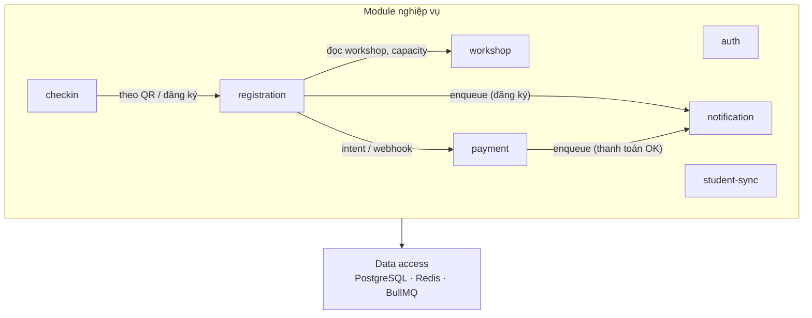
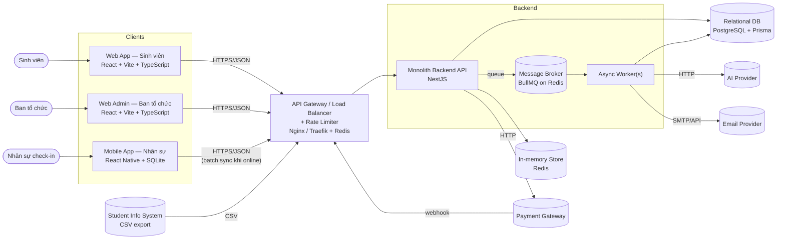
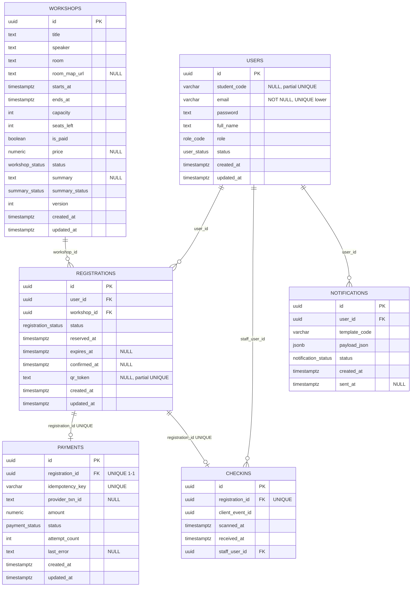

# UniHub Workshop — Technical Design

## 1. Kiến trúc tổng thể

### 1.1. Phong cách kiến trúc

**Modular Monolith cho Backend API** kết hợp với 3 hệ **client tách biệt** (Web SV, Web Admin, Mobile Staff) và một số **worker chạy nền** cho các tác vụ bất đồng bộ. Microservices ở backend tạo overhead vận hành. Monolith cho phép các module centralized và refactor dễ dàng; sẽ cân nhắc tách khi mục tiêu nghiệp vụ đủ lớn và phức tạp.

**Hàng đợi (BullMQ trên Redis)**: các **consumer** có `@Processor` gồm queue `workshop-summary`, `notifications`, `student-sync`, và `reservation-expiry`. Module **registration** / **payment** đóng vai **producer**.

| Module         | Chức năng chính                                                    | Queue (BullMQ)                                                                                                                                                                               |
| -------------- | ------------------------------------------------------------------ | -------------------------------------------------------------------------------------------------------------------------------------------------------------------------------------------- |
| `auth`         | Xác thực, kiểm tra role (RBAC)                                     | —                                                                                                                                                                                            |
| `workshop`     | CRUD workshop, quản lý số chỗ, ai summary                          | **Consumer** queue `workshop-summary` — job tóm tắt nội dung workshop (PDF → AI).                                                                                                            |
| `registration` | Giữ chỗ (reservation), xác nhận, phát hành mã QR                   | **Producer** delayed job → queue `reservation-expiry` (TTL giữ chỗ có phí); **consumer** cùng queue (worker giải phóng chỗ). **Producer** → `notifications` khi đăng ký miễn phí thành công. |
| `payment`      | Khởi tạo giao dịch, idempotency, circuit breaker                   | **Producer** enqueue → queue `notifications` (thanh toán thành công); sau confirm **xoá** delayed job giữ chỗ (không còn worker expiry cho đăng ký đó).                                      |
| `checkin`      | Nhận sự kiện check-in, chống trùng                                 | —                                                                                                                                                                                            |
| `notification` | Điều phối gửi thông báo qua nhiều kênh (app, email, …), dễ mở rộng | **Consumer** queue `notifications` — dispatch.                                                                                                                                               |
| `student-sync` | Import CSV hằng đêm từ hệ thống sinh viên cũ                       | **Consumer** queue `student-sync` — job xử lý file CSV đã nhập.                                                                                                                              |

### 1.2. Tương tác

Các module nghiệp vụ trong **Monolith** giao tiếp qua **inject service** (NestJS), không gọi HTTP nội bộ.

**Tổng quan**:

- Đăng ký workshop: cần `workshop` (đọc/khóa chỗ) và `payment` (giữ chỗ có phí); **giữ chỗ có phí** giải phóng qua **delayed job** `reservation-expiry`.
- Thông báo: khi hoàn tất đăng ký thì `registration` hoặc `payment` enqueue job cho `notification`; worker có thể **gửi email** (Mailer).
- Checkin xác nhận: cần `registration`.
- Nhập CSV: `student-sync` chỉ đồng bộ qua database.
- Xác thực & Phân quyền: `auth` cung cấp JWT/session và guard RBAC cho controller của các module còn lại.

_(HTTP: controller các module dùng **auth** (`AuthGuard`, `RolesGuard`) — không vẽ nét để tránh chồng chéo.)_

_(Ngoài ra, module `admin` đọc tổng hợp từ **workshop** và **registration** cho dashboard)_

### 1.3. Giữ chỗ có phí, thanh toán và thông báo email

**Giữ chỗ & hết hạn (không dùng cron)**

- Workshop có phí: sau transaction đăng ký, `registrations.status = reserved`, có `expires_at` (hằng `**RESERVATION_HOLD_MINUTES`, mặc định 15 phút), đã trừ `workshops.seats_left`.
- **BullMQ delayed job** queue `**reservation-expiry`**: delay đến `expires_at` (job trễ lưu trong Redis). `**jobId`**dạng`release-hold-{registrationId}`— **không dùng ký tự`:` trong id (giới hạn BullMQ).
- Worker xử lý job: trong một transaction — nếu vẫn `reserved` → `expired`, hoàn `**seats_left`**, và `**payments`**đang`\*_pending_`*của đăng ký đó →`\*\*failed\*\`\*+`last_error`.
- Sau **thanh toán thành công**: **xoá** delayed job (`cancelScheduledRelease`) để tránh chạy expiry thừa (nếu job vẫn chạy sau confirm, worker không đổi chỗ vì không còn `reserved`).

**Email (`@nestjs-modules/mailer`)**

- Worker `**notifications` gửi mail qua nodemailer (body theo `template_code`, ví dụ `registration_success`, `payment_success`).
- Env: `SMTP_`_, `MAIL_FROM`; không có `**SMTP_HOST`** → `**jsonTransport\*\`_ (không gửi SMTP thật, phục vụ dev/log).

**Khi gặp sự cố**:

| Điểm lỗi                                                                                        | Trực tiếp                                                                                                                                                                                                                                                                                                                                           | Nhận xét                                                                           |
| ----------------------------------------------------------------------------------------------- | --------------------------------------------------------------------------------------------------------------------------------------------------------------------------------------------------------------------------------------------------------------------------------------------------------------------------------------------------- | ---------------------------------------------------------------------------------- |
| **Tiến trình API Monolith** (crash, panic, leak bộ nhớ…)                                        | Toàn bộ HTTP API và worker cùng `node`/container **đều downtime** cho đến khi orchestrator khởi động lại. Không có cô lập theo module trong một process.                                                                                                                                                                                            | SPOF, cân nhắc deploy 2 process để an toàn (2 API + 1 queue).                      |
| **PostgreSQL**                                                                                  | **Hầu hết luồng nghiệp vụ đồng bộ**: workshop, đăng ký, thanh toán (ghi DB), checkin, đồng bộ danh mục user, refresh/me đọc user… đều lỗi hoặc timeout.                                                                                                                                                                                             | SPOF, cân nhắc dùng database phụ.                                                  |
| **Redis**                                                                                       | **Session đăng nhập** (`SessionStore`): web admin / nhân sự dùng session **không xác thực / không duy trì phiên** cho đến khi Redis hồi phục. **BullMQ**: không enqueue/consumer được — job `workshop-summary`, `notifications`, `student-sync`, `**reservation-expiry`** (giữ chỗ / giải phóng chỗ) **đứng hoặc không xử lý, không có worker chạy. | Ảnh hưởng rộng; **giữ chỗ có phí** không tự giải phóng khi queue/worker Redis lỗi. |
| **Consumer queue / job lẻ** (e.g., worker `notification`, `workshop-summary` chậm hoặc ném lỗi) | Thông báo chậm/thất bại có retry theo Bull; tóm tắt AI chậm/ghi `failed`.                                                                                                                                                                                                                                                                           | Các chức năng lõi của hệ thống vẫn hoạt động tốt.                                  |
| **Payment Gateway / AI bên thứ ba**                                                             | Thanh toán không khởi tạo/confirm được; không tóm tắt PDF được cho workshop đó.                                                                                                                                                                                                                                                                     |                                                                                    |

## 2. C4 Diagram

### 2.1. Level 1 — System Context

### 2.2. Level 2 — Container

---

## High-Level Architecture Diagram

### Nhập dữ liệu từ CSV đêm

Luồng mô phỏng việc hệ thống quản lý sinh viên (SIS) export CSV vào ban đêm: backend nhận nội dung CSV, parse và **upsert** vào database

#### Kích hoạt và hàng đợi

- **API**: `POST /student-sync`, multipart field `**file`**, chỉ role `**admin`**. Kiểm tra đuôi `.csv`, kích thước tối đa **12 MiB**, đọc UTF-8; nếu thiếu file hoặc rỗng thì `400`.
- **Worker**: Nội dung CSV được đưa vào **BullMQ** queue `student-sync`, job name `run`. Processor đọc `csvText` trong payload và gọi `StudentSyncService.syncFromCsvText`.
- **Lịch "đêm"**: Code hiện **không** gắn `@Cron` do không có thông tin về file CSV sẽ export thế nào; có thể đặt **cron hoặc job scheduler** trong server / bên ngoài hoặc tự động quét CSV trong database (API hỗ trợ?). Dễ dàng update thông qua `student-sync` module.

Cấu hình queue (module): **1 lần thử** mỗi job; giữ lỗi trong Redis (tuỳ cấu hình).

#### Theo dõi job

- `GET /student-sync/jobs/:jobId` — trả `state` (`waiting`, `active`, `completed`, `failed`, …). Khi `completed`, kèm `**report` (`imported`, `skippedRows`, `duplicateIdsSuperseded`, `issues`); khi `failed`, có `failedReason`.

#### Định dạng CSV (ETL)

- **Tiêu đề bắt buộc** (đủ tên cột, không phân biệt thứ tự): `id`, `student_code`, `email`, `password`, `full_name`, `status`, `created_at`, `updated_at`.
- Parser **bỏ BOM**, bỏ dòng trống; tách ô theo **dấu phẩy đơn giản** (`split`) — **không** hỗ trợ định dạng CSV có trường bọc ngoặc kép / dấu phẩy trong cell.
- `status`: `active` hoặc `disabled` (không phân biệt hoa thường).
- `created_at` / `updated_at`: chuỗi thời gian; parser chuẩn hoá khoảng trắng → `T` và một số dạng offset ngắn trước khi `new Date(...)`.
- Mỗi dòng hợp lệ được map sang bản ghi đồng bộ với `**role: 'student'`.

#### Xử lý trùng và lỗi tại tầng file

- **Trùng `id` trong cùng file**: giữ bản ghi **dòng sau** (last wins); các dòng trước ghi nhận issue `duplicate_id`.
- **Trùng `email`** (so sánh không phân biệt hoa thường) hoặc **trùng `student_code`** (khi có giá trị) giữa các dòng đã hợp lệ: bỏ qua dòng sau, issue `duplicate_email` / `duplicate_student_code`.
- Dòng lỗi định dạng (thiếu trường, `status` sai, timestamp sai, …) được ghi vào `issues` kèm **số dòng file** và không đưa vào danh sách upsert.

#### Ghi CSDL (`users`)

- Với mỗi dòng đã qua parse, `**UsersRepository.upsertSyncedStudentsReport`** gọi Prisma `**upsert`** theo `id` (**không bọc toàn bộ file trong một transaction** — một dòng lỗi không rollback các dòng khác).
- **Không ghi đè** nếu `id` đã tồn tại và `role !== 'student'` → issue `role_conflict`.
- **Không ghi** nếu `email` hoặc `student_code` (khi có) **đụng người dùng khác id** trong DB → `email_exists_db` / `student_code_exists_db`.
- Lỗi Prisma/Exception khác trên từng dòng → `db_error` (message kèm chi tiết).

---

## Thiết kế cơ sở dữ liệu

### Lựa chọn loại database

Dùng **Relational DB (SQL)** làm kho dữ liệu chính, kết hợp với **key-value store** cho dữ liệu tạm thời.

| Loại dữ liệu                                                                                                                                                                           | Storage            | Lý do                                                                                         |
| -------------------------------------------------------------------------------------------------------------------------------------------------------------------------------------- | ------------------ | --------------------------------------------------------------------------------------------- |
| User, Workshop, Registration, Payment, Check-in, Notification                                                                                                                          | **Relational DB**  | Cần ACID cho nghiệp vụ giữ chỗ và thanh toán; quan hệ giữa các entity rõ ràng; query thống kê |
| Rate-limit counter (ứng dụng: `@nestjs/throttler` mặc định là **in-memory trong process**; có thể chuyển Redis khi scale ngang), Idempotency key, Circuit breaker state, Session cache | **KV / in-memory** | Truy cập nhiều, TTL ngắn, không cần bền vững tuyệt đối                                        |

### Sơ đồ quan hệ (ER)

---

## Thiết kế kiểm soát truy cập

### Xác thực (authentication)

Backend dùng `**AuthGuard**`: đọc **Bearer JWT** (`Authorization`) hoặc **session id** (cookie/header tùy cấu hình extract), gọi `AuthService.me`, rồi gắn `req.user` (kèm `role`) cho request hiện tại. Thất bại → **401** (`unauthenticated`).

Triển khai client:

- **Web admin / nhân sự (mobile)** — **session**.
- **Sinh viên (web)** — **JWT**.

### Ủy quyền theo vai trò (RBAC)

**Triển khai tại API**, UX hỗ trợ hiển thị.

| Thành phần     | Vai trò                                                                                                                          |
| -------------- | -------------------------------------------------------------------------------------------------------------------------------- |
| `**RolesGuard` | Đọc metadata `@Roles(...)` trên handler hoặc class (`Reflector`); nếu route **không** khai báo role thì không chặn theo vai trò. |
| `**@Roles`     | Liệt kê một hoặc nhiều `RoleCode` được phép (`'student'                                                                          |
| Chuỗi guard    | Route cần phân quyền đặt `@UseGuards(AuthGuard, RolesGuard)` — **luôn cần** `AuthGuard` trước để có `req.user`.                  |

Luồng trong `RolesGuard`:

- Không có `req.user` → **401**.
- `user.role` không nằm trong danh sách `@Roles` → **403** (`forbidden`).
- Thuộc danh sách → cho phép tiếp tục (sau đó tằng service vẫn có thể giới hạn theo **id chủ thể**, ví dụ chỉ đọc đăng ký của chính user đó).

### Permission

| Role        | Permission (ý định)                                                                                                             |
| ----------- | ------------------------------------------------------------------------------------------------------------------------------- |
| `student`   | `workshop:read`, `registration:create(self)`, `registration:read(self)`, `registration:cancel(self)`, `notification:read(self)` |
| `organizer` | `workshop:`, `registration:read(any)`                                                                                           |
| `staff`     | `checkin:create`, `checkin:batch_sync`, `registration:read(byqr)`                                                               |
| `admin`     | Toàn quyền trên các route được bảo vệ bằng role (và các route chỉ `@Roles('admin')` như nhập CSV).                              |

---

## Thiết kế các cơ chế bảo vệ hệ thống

### Kiểm soát tải đột biến

**Chiến lược nhiều lớp** (thiết kế):

| Lớp                                    | Vai trò                                                                                                                                                           |
| -------------------------------------- | ----------------------------------------------------------------------------------------------------------------------------------------------------------------- |
| **Gateway / LB**                       | Là vị chí chủ chốt, rate limit và TLS gần biên mạng; bảo vệ trước khi request vào Node.                                                                           |
| **Ứng dụng API (`@nestjs/throttler`)** | Fixed window, giới hạn theo **IP client** trên toàn API và **siết thêm** trên từng route nhạy cảm.                                                                |
| **Queue & worker**                     | Tách xử lý nặng (CSV, email, summary PDF, expiry giữ chỗ) khỏi luồng HTTP đồng bộ — spike HTTP không nhất thiết đồng nghĩa spike ghi DB đồng bộ cho mọi thao tác. |

#### Bảng preset route (cửa sổ 60 giây)

| Endpoint / nhóm                                    | Giới hạn (limit / TTL) | Ghi chú                                  |
| -------------------------------------------------- | ---------------------- | ---------------------------------------- |
| `POST /auth/login/jwt`, `POST /auth/login/session` | **10** / 60s           | Giảm brute-force mật khẩu.               |
| `GET /auth/me/jwt`, `POST /auth/refresh`           | **30** / 60s           | Giới hạn làm mới token quá dày.          |
| `POST /registrations`                              | **20** / 60s           | Giảm spam đăng ký / enqueue kèm giữ chỗ. |
| `POST /payments`                                   | **15** / 60s           | Giảm khởi tạo thanh toán lặp lại.        |
| `POST /student-sync`                               | **5** / 60s            | Upload CSV đẩy job BullMQ — siết riêng.  |

#### Hành vi khi vượt ngưỡng

- Framework trả **HTTP 429** (Too Many Requests); client backoff / retry có jitter.

#### Giới hạn thiết kế & hướng mở rộng

- **Storage mặc định của `@nestjs/throttler` là in-memory trong process**: khi chạy **nhiều replica** API, mỗi instance có **bộ đếm riêng** — ngưỡng thực tế trên một IP ≈ nhân với số replica (trừ khi có sticky session luôn trúng một pod). Để đếm **chung giữa các instance**, có thể chuyển sang storage Redis (plugin / custom `ThrottlerStorage`) hoặc giữ rate limit chủ đạo tại **gateway**.
- Rate limit **theo IP** không chặn được kịch bản **nhiều IP phân tán** (botnet); có thể chấp nhận trong kịch bản trường học.

### Xử lý cổng thanh toán không ổn định

#### Giải pháp triển khai (`PaymentGatewayCircuitBreakerService`)

| Thành phần                  | Vai trò                                                                                                                                                                                                                                          |
| --------------------------- | ------------------------------------------------------------------------------------------------------------------------------------------------------------------------------------------------------------------------------------------------ |
| **Circuit breaker (CB)**    | Theo dõi **lỗi hạ tầng** liên quan cổng (Redis key `payment_gateway:circuit:v1`). Khi vượt ngưỡng → tạm **ngưng initiate** checkout (`POST /payments`) trong một khoảng thời gian (trạng thái **Open**).                                         |
| **Graceful degradation**    | Khi CB chặn hoặc **health probe** thất bại: có thể trả **HTTP 200** kèm payload “giảm chức năng” (`degraded`, `retryAfterSeconds`, `userMessage`) thay vì lỗi cứng. Tuỳ chọn **HTTP 503** khi tắt graceful.                                      |
| **Health probe (tuỳ chọn)** | Trước khi vào nhánh initiate thật, có thể **GET** `PAYMENT_GATEWAY_HEALTHCHECK_URL`; **5xx**, **429**, timeout → đếm là **một lỗi hạ tầng** (`recordInfrastructureFailure`) và phản hồi graceful/block ngay request đó (không chờ đủ ngưỡng CB). |

#### Luồng initiate và CB trong code (`POST /payments`)

1. Kiểm tra nghiệp vụ (workshop có phí, payment/refund/reservation/reg.status…).
2. `evaluateInitiateGate()` — nếu CB đang **Open** trong cửa sổ cooldown → trả degraded hoặc **503**, không probe và không tăng `attemptCount`.
3. `**optionalPaymentGatewayHealthProbe()`** (chỉ khi có URL) — fail → `**recordInfrastructureFailure()\*\*`và phản hồi degraded/block ngay (message probe +`retryAfterSeconds`), không bắt user chờ đủ threshold để biết cổng đang lỗi.
4. Nhánh **mock redirect** hoặc **finalize đồng bộ** — `**attemptCount` chỉ được increment sau khi đã qua (2)(3).
5. `**finalizePaymentSuccess`** (đồng bộ hoặc webhook) gọi `**recordCheckoutSuccess()**` → reset CB về **Closed\*\* và xóa đếm lỗi.

#### Các trạng thái CB

| Trạng thái    | Ý nghĩa                                                                                                                                                                              | Chuyển trạng thái (tóm tắt)                                                                       |
| ------------- | ------------------------------------------------------------------------------------------------------------------------------------------------------------------------------------ | ------------------------------------------------------------------------------------------------- |
| **Closed**    | Cho phép initiate. Đếm `failures` khi có lỗi hạ tầng; **thanh toán hoàn tất thành công** → reset về Closed + `failures = 0`.                                                         | `failures ≥ threshold` → **Open** + ghi `openedAtMs`.                                             |
| **Open**      | Trong `PAYMENT_GATEWAY_CB_RESET_MS` kể từ mở, initiate bị graceful hoặc 503.                                                                                                         | Hết cooldown → request đầu tiên đưa vào **Half-open** (ghi state Redis) và cho phép thử initiate. |
| **Half-open** | Cho phép thử lại luồng initiate (probe + checkout). **Thành công** checkout (finalize / webhook OK) → **Closed** đầy đủ. **Lỗi hạ tầng** tiếp → **Open** lại (đặt `openedAtMs` mới). |

#### Hành vi khi CB chặn

- **Circuit đang Open (trong cooldown)** → `POST /payments`: không vào nhánh thanh toán; client nhận **200 degraded** hoặc **503** tuỳ `PAYMENT_GATEWAY_CB_GRACEFUL_RESPONSE`; **không** tăng `attemptCount` payment trong nhánh đó (gate chạy trước increment mock/sync).
- **Probe fail** → một lần `recordInfrastructureFailure`; đồng thời phản hồi degraded/block với message kiểm tra sức khỏe cổng.
- **Thanh toán thành công**: reset CB về Closed.

### Chống trừ tiền hai lần

**Mục tiêu**: tránh hai lần “bắt đầu thanh toán” cho cùng một ý định (double click, retry mạng, tab trùng) dẫn tới **tăng `attemptCount` hai lần**, **hai phiên checkout mock**, hoặc hai lần đẩy lệnh tới cổng thật sau này. **Định danh học sinh không bị debit hai lần** về mặt bản chất vẫn dựa trên **`payment.status = succeeded`** (webhook/sync finalize chỉ được phép một lần “settle”; idempotency ở đây bổ sung tầng **initiate UX + an toàn hạ tầng**).

#### Cơ chế

| Lớp | Nội dung |
| --- | -------- |
| **Idempotency-Key trên `POST /payments`** | Bắt buộc header `Idempotency-Key` (client giữ **cùng một key** cho mọi retry của **một intent**). API client bọc qua `withIdempotencyKey` (Web SV giữ key ở state trang thanh toán). |
| **Một intent → một snapshot Redis** | Sau redirect mock hoặc **finalize đồng bộ**, lưu snapshot tối giản **`registrationId`**, **`redirectUrl`** (nullable). Tên Redis key dùng `userId` + **SHA-256** của giá trị header (không đặt nguyên key thô vào Redis key string). |
| **Replay an toàn** | Cùng `(userId, Idempotency-Key)` và snapshot còn TTL → trả **cùng redirect** hoặc **succeeded đọc từ Postgres** — **không** cộng `attemptCount`, **không** tạo phiên checkout mới; luôn **đọc lại** row `payments` khớp `registration`. |
| **Đăng ký (registration)** | Workshop có phí: cột **`idempotency_key` UNIQUE** globale trong DB khi tạo payment lúc đăng ký — tách luồng **chống hai bản đăng ký hai payment** khỏi luồng **replay initiate**. |

#### Nơi lưu trữ

- **Redis**: prefix `payment_init:idemp:v1:`. **Fail-open** khi ghi: thanh toán vẫn chạy; replay có thể tạm thời không dùng được.
- **PostgreSQL**: nguồn sự thật **`payment.status`**, **`provider_txn_id`**, **`attempt_count`**; webhook/finalize idempotent không “trừ tiền” lần hai khi đã `succeeded`.

#### TTL

- Env **`PAYMENT_INIT_IDEMPOTENCY_TTL_SECONDS`** (`src/apps/api/.env.example`; mặc định code **86400** giây) là trần TTL snapshot.
- Có **`expires_at` giữ chỗ**: TTL tính = `min(trần cấu hình, max(300, giây còn đến hết chỗ + 120 đệm))`, rồi **tối thiểu 120** trong code TTL logic; khi `SET` vào Redis, `EX ≥ max(60, TTL)` — tránh TTL quá ngắn gây mất replay vô lý nhưng vẫn **không** kéo dài replay sau khi chỗ reservation hết hiệu lực (trừ đệm có chủ đích).

#### Luồng xử lý khi phát hiện trùng lặp

1. Gate circuit breaker + probe như luồng `POST /payments` thường.
2. **Đọc Redis** `(userId, Idempotency-Key)`:
   - Không có key → initiate đầy đủ → `SETEX` snapshot + TTL.
   - Có snapshot nhưng `registrationId` ≠ body → **409** `payment_init_idempotency_scope_mismatch`.
   - Khớp `registrationId`:
     - DB `succeeded` → 200 `{ payment, redirectUrl: null }`.
     - `pending` + snapshot có **`redirectUrl`** → 200 cùng URL, không increment/mock session mới.
     - `pending` nhưng snapshot thiếu redirect hoặc lệch thực tế DB → **XÓA** key Redis, **retry initiate** như request mới (phòng cache hỏng hoặc state đổi).

#### Thiếu / sai header

- Thiếu `Idempotency-Key` (sau trim) → **400** `payment_init_idempotency_required`.
- Key **> 191** ký tự → **400** `payment_init_idempotency_invalid`.

#### Giới hạn / lưu ý

- Với cổng thanh toán production cần thêm **idempotency của provider** cho lệnh capture/debit — header này chỉ bọc initiate nội bộ + mock UX.
- Session checkout **mock trong RAM** có TTL riêng; Redis replay có thể dài hơn — có thể cần **intent mới + key mới** nếu URL mock đã hết session nhưng key Redis vẫn đòi replay redirect cũ (xử lý sẽ có thể dẫn tới invalidate hoặc lỗi UI tùy cấu hình).

---

## Các quyết định kỹ thuật

**Web App (Sinh viên + Admin) → React + Vite + TypeScript**:

- Phổ biến, hệ sinh thái lớn, nhiều thư viện và tài liệu hỗ trợ.
- Là UI library thay vì framework hoàn chỉnh, giúp **linh hoạt** và nhẹ hơn so với Angular.
- So với Vue.js, React có cộng đồng lớn hơn và dễ tìm giải pháp khi gặp vấn đề.
- Sử dụng Vite để tối ưu tốc độ phát triển và build.
- Không sử dụng SSR nhằm giảm tải xử lý phía server trong các giai đoạn truy cập tăng đột biến.

**Mobile App (Nhân sự) → React Native**:

- **Cross-platform** nhằm giảm công sức phát triển và bảo trì so với xây dựng native riêng cho từng nền tảng.
- Tận dụng chung hệ sinh thái React để tái sử dụng API client, types và một phần business logic từ web app, thay vì sử dụng Dart như Flutter.
- Local storage sử dụng Expo SQLite cho check-in offline. Cân nhắc chuyển sang WatermelonDB khi dữ liệu hoặc nhu cầu đồng bộ tăng lớn hơn.

**Backend → NestJS (Node.js + TypeScript)**:

- Kiến trúc **module-based** phù hợp với mô hình Modular Monolith đã chọn, trong đó mỗi nghiệp vụ được tổ chức thành một module riêng của NestJS.
- **Dependency Injection** tích hợp sẵn, giúp dễ kiểm thử và dễ thay thế implementation giữa các thành phần (ví dụ notification service).
- Sử dụng cùng ngôn ngữ TypeScript với frontend, cho phép chia sẻ types thông qua package nội bộ, giảm sai lệch API giữa client và server.
- So với Express.js thuần, framework đã hỗ trợ:
  - `@nestjs/bullmq` cho queue/background jobs.
  - `@nestjs-modules/mailer` cho gửi email thông báo.
  - `@nestjs/throttler` cho rate limiting phía application.
  - Guards và interceptors phù hợp để triển khai RBAC và cross-cutting concerns.

**Others**

- **Relational DB → PostgreSQL + Prisma**: hỗ trợ mạnh về các tính năng SQL như transaction, JSONB, CTE...
- **In-memory store → Redis**: mặc định.
- **Message broker → Redis Streams + BullMQ**: cân nhắc **RabbitMQ** nếu cần nhiều consumer routing pattern phức tạp hay quy mô phân tán mở rộng, **Kafka** nếu cần lưu lại lịch sử (thông báo) hoặc lưu dữ liệu stream.

### Modular Monolith

- **Lựa chọn**: Một backend process duy nhất xây dựng bằng NestJS, được chia thành các module ánh xạ 1-1 với từng module nghiệp vụ.
- **Tại sao**:
  - Phù hợp với phạm vi yêu cầu vừa phải và quy mô team nhỏ.
  - Nhiều luồng nghiệp vụ (đặc biệt là đăng ký và thanh toán) cần transaction ACID xuyên nhiều entity, monolith giúp xử lý đơn giản và nhất quán hơn so với distributed transaction.
  - Cung cấp sẵn module system và Dependency Injection, giúp chuẩn hóa cấu trúc dự án mà không cần tự thiết kế lại layering từ đầu.
- **Đánh đổi**:
  - Khả năng scale độc lập giữa các module kém linh hoạt hơn so với microservices.
  - Ngoại trừ các worker hoặc module xử lý tác vụ nặng được tách riêng, một lỗi nghiêm trọng trong hệ thống chính có thể ảnh hưởng toàn bộ server process.
- **Cân nhắc**: Từng module có thể được tách dần khi:
  - Khi hệ thống cần phục vụ tải lớn hơn nhiều so với hiện tại.
  - Module có quy mô và nhịp phát triển khác biệt rõ rệt.

### Authentication

- **Lựa chọn:**
  - JWT stateless cho web sinh viên.
  - Session-based authentication cho web admin và mobile staff.
- **Tại sao:**
  - Web sinh viên ưu tiên scale ngang và giảm phụ thuộc vào shared session storage.
  - Admin và staff yêu cầu revoke session để tăng cường bảo mật và kiểm soát truy cập.
- **Đánh đổi:**
  - JWT stateless khó revoke access token trước thời hạn hết hạn.
  - Giảm thiểu bằng cách sử dụng access token có TTL ngắn (ví dụ 15 phút) kết hợp refresh token có thể revoke phía server.
- **Thuật toán ký:** Sử dụng HS256 cho JWT trong kiến trúc monolith nhằm giữ triển khai đơn giản và dễ quản lý secret nội bộ.

### Relational Database

- **Lựa chọn**: SQL với PostgreSQL.
- **Tại sao**:
  - Nghiệp vụ lõi yêu cầu tính nhất quán cao, transaction ACID, cùng nhiều constraint và quan hệ phức tạp — phù hợp với thế mạnh của RDBMS, đặc biệt là PostgreSQL.
  - Số lượng entity và mức độ phức tạp dữ liệu vẫn nằm trong phạm vi phù hợp với relational model.
  - Không có yêu cầu về schema động hoặc dữ liệu phi cấu trúc ở quy mô lớn.
- **Đánh đổi**:
  - Khi tải tăng cao, cần chú ý đến contention do lock, chiến lược indexing và tối ưu query để tránh ảnh hưởng hiệu năng.
  - Việc scale write theo chiều ngang khó hơn.
