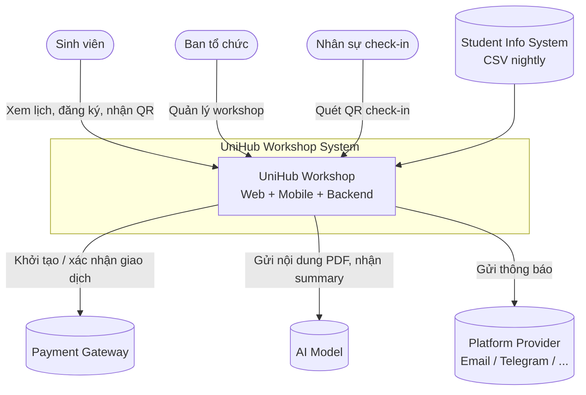

# UniHub Workshop — Technical Design

## Kiến trúc tổng thể

### Phong cách kiến trúc

**Modular Monolith cho Backend API** kết hợp với 3 hệ **client tách biệt** (Web SV, Web Admin, Mobile Staff) và một số **worker chạy nền** cho các tác vụ bất đồng bộ. Microservices ở backend tạo overhead vận hành. Monolith cho phép các module centralized và refactor dễ dàng; sẽ cân nhắc tách khi mục tiêu nghiệp vụ đủ lớn và phức tạp.

### C4 Diagram

#### Level 1 — System Context

## Tech-stack

**Web App (Sinh viên + Admin) — React + Vite + TypeScript**:

- Phổ biến, hệ sinh thái lớn, nhiều thư viện và tài liệu hỗ trợ.
- Là UI library thay vì framework hoàn chỉnh, giúp **linh hoạt** và nhẹ hơn so với Angular.
- So với Vue.js, React có cộng đồng lớn hơn và dễ tìm giải pháp khi gặp vấn đề.
- Sử dụng Vite để tối ưu tốc độ phát triển và build.
- Không sử dụng SSR nhằm giảm tải xử lý phía server trong các giai đoạn truy cập tăng đột biến.

**Mobile App (Nhân sự) — React Native**:

- **Cross-platform** nhằm giảm công sức phát triển và bảo trì so với xây dựng native riêng cho từng nền tảng.
- Tận dụng chung hệ sinh thái React để tái sử dụng API client, types và một phần business logic từ web app, thay vì sử dụng Dart như Flutter.
- Local storage sử dụng Expo SQLite cho check-in offline. Cân nhắc chuyển sang WatermelonDB khi dữ liệu hoặc nhu cầu đồng bộ tăng lớn hơn.

**Backend — NestJS (Node.js + TypeScript)**:

- Kiến trúc **module-based** phù hợp với mô hình Modular Monolith đã chọn, trong đó mỗi nghiệp vụ được tổ chức thành một module riêng của NestJS.
- **Dependency Injection** tích hợp sẵn, giúp dễ kiểm thử và dễ thay thế implementation giữa các thành phần (ví dụ notification service).
- Sử dụng cùng ngôn ngữ TypeScript với frontend, cho phép chia sẻ types thông qua package nội bộ, giảm sai lệch API giữa client và server.
- So với Express.js thuần, framework đã hỗ trợ:
	- `@nestjs/typeorm` hoặc Prisma cho SQL ORM.
	- `@nestjs/bullmq` cho queue/background jobs.
	- `@nestjs/schedule` cho cron jobs.
	- `@nestjs/throttler` cho rate limiting phía application.
	- Guards và interceptors phù hợp để triển khai RBAC và cross-cutting concerns.

**Database**

- **Relational DB → PostgreSQL**: hỗ trợ mạnh về các tính năng SQL như transaction, JSONB, CTE...
	- ORM dùng **Prisma**

