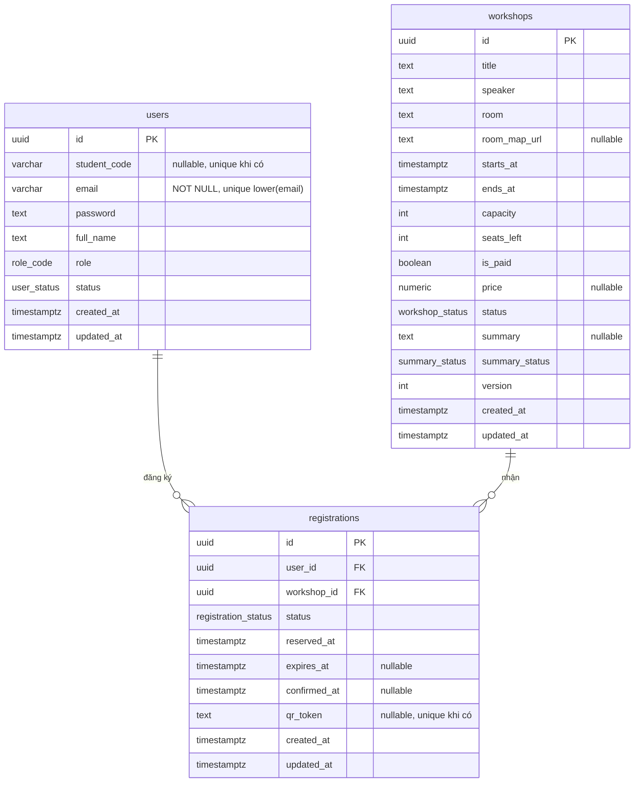

# UniHub Workshop — Technical Design

## Kiến trúc tổng thể

### Phong cách kiến trúc

**Modular Monolith cho Backend API** kết hợp với 3 hệ **client tách biệt** (Web SV, Web Admin, Mobile Staff) và một số **worker chạy nền** cho các tác vụ bất đồng bộ. Microservices ở backend tạo overhead vận hành. Monolith cho phép các module centralized và refactor dễ dàng; sẽ cân nhắc tách khi mục tiêu nghiệp vụ đủ lớn và phức tạp.

| Module         | Chức năng chính                                                    |
| -------------- | ------------------------------------------------------------------ |
| `auth`         | Xác thực, kiểm tra role (RBAC)                                     |
| `workshop`     | CRUD workshop, quản lý số chỗ, ai summary                          |
| `registration` | Giữ chỗ (reservation), xác nhận, phát hành mã QR                   |
| `payment`      | Khởi tạo giao dịch, idempotency, circuit breaker                   |
| `checkin`      | Nhận sự kiện check-in, chống trùng                                 |
| `notification` | Điều phối gửi thông báo qua nhiều kênh (app, email, …), dễ mở rộng |
| `student-sync` | Import CSV hằng đêm từ hệ thống sinh viên cũ                       |

### C4 Diagram

#### Level 1 — System Context

---

## Bảo mật

### Xác thực (authentication)

Backend dùng **`AuthGuard`**: đọc **Bearer JWT** (`Authorization`) hoặc **session id** (cookie/header tùy cấu hình extract), gọi `AuthService.me`, rồi gắn `req.user` (kèm `role`) cho request hiện tại. Thất bại → **401** (`unauthenticated`).

Triển khai client:

- **Web admin / nhân sự (mobile)** — **session**.
- **Sinh viên (web)** — **JWT**.

### Ủy quyền theo vai trò (RBAC)

**Triển khai tại API**, UX hỗ trợ hiển thị.

| Thành phần       | Vai trò                                                                                                                          |
| ---------------- | -------------------------------------------------------------------------------------------------------------------------------- |
| **`RolesGuard`** | Đọc metadata `@Roles(...)` trên handler hoặc class (`Reflector`); nếu route **không** khai báo role thì không chặn theo vai trò. |
| **`@Roles`**     | Liệt kê một hoặc nhiều `RoleCode` được phép (`'student' \| 'organizer' \| 'staff' \| 'admin'`).                                  |
| Chuỗi guard      | Route cần phân quyền đặt `@UseGuards(AuthGuard, RolesGuard)` — **luôn cần** `AuthGuard` trước để có `req.user`.                  |

Luồng trong `RolesGuard`:

- Không có `req.user` → **401**.
- `user.role` không nằm trong danh sách `@Roles` → **403** (`forbidden`).
- Thuộc danh sách → cho phép tiếp tục (sau đó tằng service vẫn có thể giới hạn theo **id chủ thể**, ví dụ chỉ đọc đăng ký của chính user đó).

### Permission

| Role        | Permission (ý định)                                                                                                             |
| ----------- | ------------------------------------------------------------------------------------------------------------------------------- |
| `student`   | `workshop:read`, `registration:create(self)`, `registration:read(self)`, `registration:cancel(self)`, `notification:read(self)` |
| `organizer` | `workshop:*`, `registration:read(any)`                                                                                          |
| `staff`     | `checkin:create`, `checkin:batch_sync`, `registration:read(byqr)`                                                               |
| `admin`     | Toàn quyền trên các route được bảo vệ bằng role (và các route chỉ `@Roles('admin')` như nhập CSV).                              |

---

## Cơ sở dữ liệu

### Lựa chọn loại database

Dùng **Relational DB (SQL)** làm kho dữ liệu chính, kết hợp với **key-value store** cho dữ liệu tạm thời.

| Loại dữ liệu                                                              | Storage            | Lý do                                                                                         |
| ------------------------------------------------------------------------- | ------------------ | --------------------------------------------------------------------------------------------- |
| User, Role, Workshop, Registration, Payment, CheckIn                      | **Relational DB**  | Cần ACID cho nghiệp vụ giữ chỗ và thanh toán; quan hệ giữa các entity rõ ràng; query thống kê |
| Rate-limit counter, Idempotency key, Circuit breaker state, Session cache | **KV / in-memory** | Truy cập nhiều, TTL ngắn, không cần bền vững tuyệt đối                                        |

### Sơ đồ quan hệ (ER)

---

## Luồng nghiệp vụ quan trọng

### Nhập dữ liệu từ CSV đêm

Luồng mô phỏng việc hệ thống quản lý sinh viên (SIS) export CSV vào ban đêm: backend nhận nội dung CSV, parse và **upsert** vào database

#### Kích hoạt và hàng đợi

- **API**: `POST /student-sync`, multipart field **`file`**, chỉ role **`admin`**. Kiểm tra đuôi `.csv`, kích thước tối đa **12 MiB**, đọc UTF-8; nếu thiếu file hoặc rỗng thì `400`.
- **Worker**: Nội dung CSV được đưa vào **BullMQ** queue `student-sync`, job name `run`. Processor đọc `csvText` trong payload và gọi `StudentSyncService.syncFromCsvText`.
- **Lịch "đêm"**: Code hiện **không** gắn `@Cron` do không có thông tin về file CSV sẽ export thế nào; có thể đặt **cron hoặc job scheduler** trong server / bên ngoài hoặc tự động quét CSV trong database (API hỗ trợ?). Dễ dàng update thông qua `student-sync` module.

Cấu hình queue (module): **1 lần thử** mỗi job; giữ lỗi trong Redis (tuỳ cấu hình).

#### Theo dõi job

- `GET /student-sync/jobs/:jobId` — trả `state` (`waiting`, `active`, `completed`, `failed`, …). Khi `completed`, kèm **`report`** (`imported`, `skippedRows`, `duplicateIdsSuperseded`, `issues`); khi `failed`, có `failedReason`.

#### Định dạng CSV (ETL)

- **Tiêu đề bắt buộc** (đủ tên cột, không phân biệt thứ tự): `id`, `student_code`, `email`, `password`, `full_name`, `status`, `created_at`, `updated_at`.
- Parser **bỏ BOM**, bỏ dòng trống; tách ô theo **dấu phẩy đơn giản** (`split`) — **không** hỗ trợ định dạng CSV có trường bọc ngoặc kép / dấu phẩy trong cell.
- `status`: `active` hoặc `disabled` (không phân biệt hoa thường).
- `created_at` / `updated_at`: chuỗi thời gian; parser chuẩn hoá khoảng trắng → `T` và một số dạng offset ngắn trước khi `new Date(...)`.
- Mỗi dòng hợp lệ được map sang bản ghi đồng bộ với **`role: 'student'`**.

#### Xử lý trùng và lỗi tại tầng file

- **Trùng `id` trong cùng file**: giữ bản ghi **dòng sau** (last wins); các dòng trước ghi nhận issue `duplicate_id`.
- **Trùng `email`** (so sánh không phân biệt hoa thường) hoặc **trùng `student_code`** (khi có giá trị) giữa các dòng đã hợp lệ: bỏ qua dòng sau, issue `duplicate_email` / `duplicate_student_code`.
- Dòng lỗi định dạng (thiếu trường, `status` sai, timestamp sai, …) được ghi vào `issues` kèm **số dòng file** và không đưa vào danh sách upsert.

#### Ghi CSDL (`users`)

- Với mỗi dòng đã qua parse, **`UsersRepository.upsertSyncedStudentsReport`** gọi Prisma **`upsert`** theo `id` (**không bọc toàn bộ file trong một transaction** — một dòng lỗi không rollback các dòng khác).
- **Không ghi đè** nếu `id` đã tồn tại và `role !== 'student'` → issue `role_conflict`.
- **Không ghi** nếu `email` hoặc `student_code` (khi có) **đụng người dùng khác id** trong DB → `email_exists_db` / `student_code_exists_db`.
- Lỗi Prisma/Exception khác trên từng dòng → `db_error` (message kèm chi tiết).

---

## Tech-stack

**Web App (Sinh viên + Admin) → React + Vite + TypeScript**:

- Phổ biến, hệ sinh thái lớn, nhiều thư viện và tài liệu hỗ trợ.
- Là UI library thay vì framework hoàn chỉnh, giúp **linh hoạt** và nhẹ hơn so với Angular.
- So với Vue.js, React có cộng đồng lớn hơn và dễ tìm giải pháp khi gặp vấn đề.
- Sử dụng Vite để tối ưu tốc độ phát triển và build.
- Không sử dụng SSR nhằm giảm tải xử lý phía server trong các giai đoạn truy cập tăng đột biến.

**Mobile App (Nhân sự) → React Native**:

- **Cross-platform** nhằm giảm công sức phát triển và bảo trì so với xây dựng native riêng cho từng nền tảng.
- Tận dụng chung hệ sinh thái React để tái sử dụng API client, types và một phần business logic từ web app, thay vì sử dụng Dart như Flutter.
- Local storage sử dụng Expo SQLite cho check-in offline. Cân nhắc chuyển sang WatermelonDB khi dữ liệu hoặc nhu cầu đồng bộ tăng lớn hơn.

**Backend → NestJS (Node.js + TypeScript)**:

- Kiến trúc **module-based** phù hợp với mô hình Modular Monolith đã chọn, trong đó mỗi nghiệp vụ được tổ chức thành một module riêng của NestJS.
- **Dependency Injection** tích hợp sẵn, giúp dễ kiểm thử và dễ thay thế implementation giữa các thành phần (ví dụ notification service).
- Sử dụng cùng ngôn ngữ TypeScript với frontend, cho phép chia sẻ types thông qua package nội bộ, giảm sai lệch API giữa client và server.
- So với Express.js thuần, framework đã hỗ trợ:
  - `@nestjs/bullmq` cho queue/background jobs.
  - `@nestjs/throttler` cho rate limiting phía application.
  - Guards và interceptors phù hợp để triển khai RBAC và cross-cutting concerns.

**Others**

- **Relational DB → PostgreSQL + Prisma**: hỗ trợ mạnh về các tính năng SQL như transaction, JSONB, CTE...
- **In-memory store → Redis**: mặc định.
- **Message broker → Redis Streams + BullMQ**: cân nhắc **RabbitMQ** nếu cần nhiều consumer routing pattern phức tạp hay quy mô phân tán mở rộng, **Kafka** nếu cần lưu lại lịch sử (thông báo) hoặc lưu dữ liệu stream.

---

## Các quyết định kỹ thuật

### Modular Monolith

- **Lựa chọn**: Một backend process duy nhất xây dựng bằng NestJS, được chia thành các module ánh xạ 1-1 với từng module nghiệp vụ.
- **Tại sao**:
  - Phù hợp với phạm vi yêu cầu vừa phải và quy mô team nhỏ.
  - Nhiều luồng nghiệp vụ (đặc biệt là đăng ký và thanh toán) cần transaction ACID xuyên nhiều entity, monolith giúp xử lý đơn giản và nhất quán hơn so với distributed transaction.
  - Cung cấp sẵn module system và Dependency Injection, giúp chuẩn hóa cấu trúc dự án mà không cần tự thiết kế lại layering từ đầu.
- **Đánh đổi**:
  - Khả năng scale độc lập giữa các module kém linh hoạt hơn so với microservices.
  - Ngoại trừ các worker hoặc module xử lý tác vụ nặng được tách riêng, một lỗi nghiêm trọng trong hệ thống chính có thể ảnh hưởng toàn bộ server process.
- **Cân nhắc**: Từng module có thể được tách dần khi:
  - Khi hệ thống cần phục vụ tải lớn hơn nhiều so với hiện tại.
  - Module có quy mô và nhịp phát triển khác biệt rõ rệt.

### Authentication

- **Lựa chọn:**
  - JWT stateless cho web sinh viên.
  - Session-based authentication cho web admin và mobile staff.
- **Tại sao:**
  - Web sinh viên ưu tiên scale ngang và giảm phụ thuộc vào shared session storage.
  - Admin và staff yêu cầu revoke session để tăng cường bảo mật và kiểm soát truy cập.
- **Đánh đổi:**
  - JWT stateless khó revoke access token trước thời hạn hết hạn.
  - Giảm thiểu bằng cách sử dụng access token có TTL ngắn (ví dụ 15 phút) kết hợp refresh token có thể revoke phía server.
- **Thuật toán ký:** Sử dụng HS256 cho JWT trong kiến trúc monolith nhằm giữ triển khai đơn giản và dễ quản lý secret nội bộ.

### Relational Database

- **Lựa chọn**: SQL với PostgreSQL.
- **Tại sao**:
  - Nghiệp vụ lõi yêu cầu tính nhất quán cao, transaction ACID, cùng nhiều constraint và quan hệ phức tạp — phù hợp với thế mạnh của RDBMS, đặc biệt là PostgreSQL.
  - Số lượng entity và mức độ phức tạp dữ liệu vẫn nằm trong phạm vi phù hợp với relational model.
  - Không có yêu cầu về schema động hoặc dữ liệu phi cấu trúc ở quy mô lớn.
- **Đánh đổi**:
  - Khi tải tăng cao, cần chú ý đến contention do lock, chiến lược indexing và tối ưu query để tránh ảnh hưởng hiệu năng.
  - Việc scale write theo chiều ngang khó hơn.
