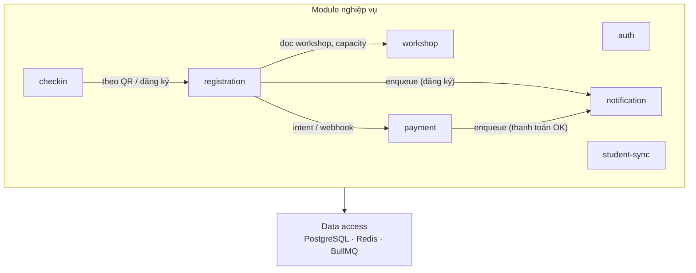
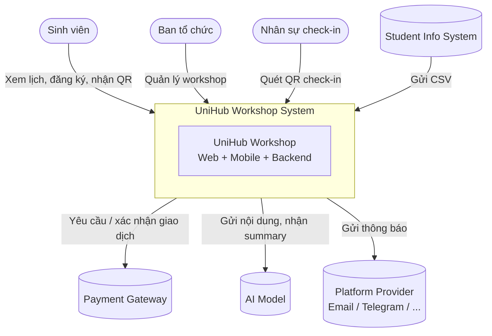
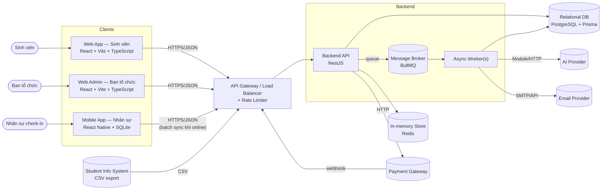
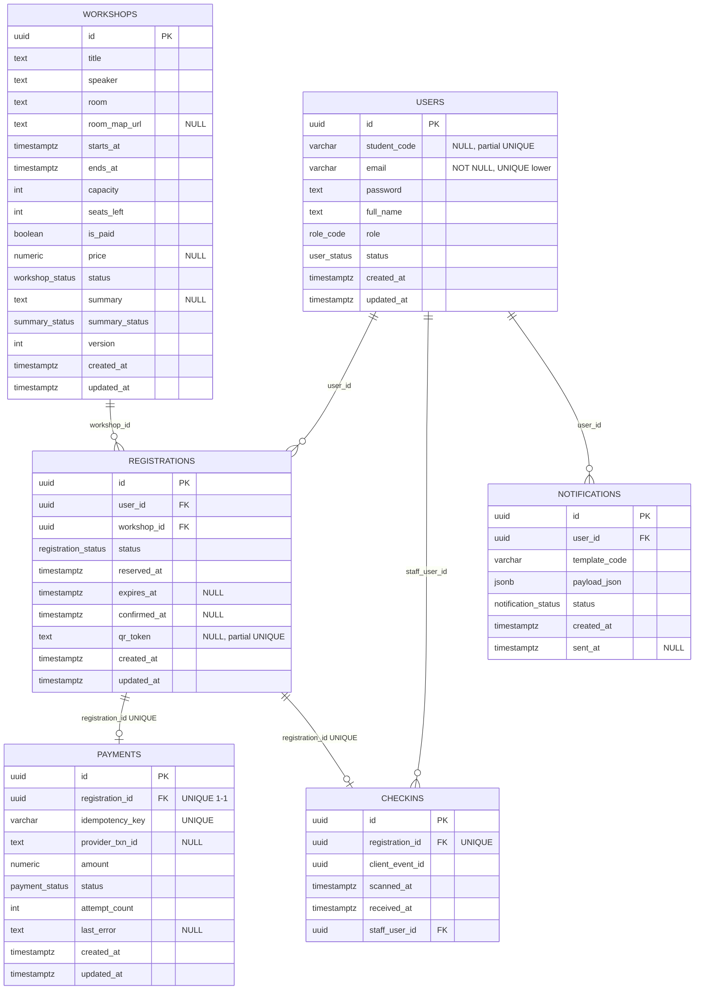

# UniHub Workshop — Technical Design

---

## 1. Kiến trúc tổng thể

### 1.1. Phong cách kiến trúc

**Modular Monolith cho Backend API** và **worker chạy nền** kết hợp với 3 hệ **client tách biệt** (Web SV, Web Admin, Mobile Staff). Microservices ở backend tạo overhead vận hành. Monolith cho phép các module centralized, refactor dễ dàng, với các yêu cầu nghiệp vụ có liên quan chặt chẽ khó tách biệt; sẽ cân nhắc tách khi mục tiêu nghiệp vụ đủ lớn và phức tạp. Có thể cân nhắc tách worker chạy nền và api process riêng.

**Queue**:

- _Consumer_: `workshop-summary`, `notifications`, `student-sync`, `reservation-expiry`.
- _Producer_: `registration` / `payment`.

### 1.2. Tương tác

Các module nghiệp vụ giao tiếp qua **inject service** (NestJS), không gọi HTTP nội bộ.

| Module         | Chức năng                                                          | Queue (BullMQ)                                                                                                                                                                               |
| -------------- | ------------------------------------------------------------------ | -------------------------------------------------------------------------------------------------------------------------------------------------------------------------------------------- |
| `auth`         | Xác thực, kiểm tra role (RBAC)                                     | —                                                                                                                                                                                            |
| `workshop`     | CRUD workshop, quản lý số chỗ, ai summary                          | **Consumer** queue `workshop-summary` — job tóm tắt nội dung workshop (PDF → AI).                                                                                                            |
| `registration` | Giữ chỗ (reservation), xác nhận, phát hành mã QR                   | **Producer** delayed job → queue `reservation-expiry` (TTL giữ chỗ có phí); **consumer** cùng queue (worker giải phóng chỗ). **Producer** → `notifications` khi đăng ký miễn phí thành công. |
| `payment`      | Khởi tạo giao dịch, idempotency, circuit breaker                   | **Producer** enqueue → queue `notifications` (thanh toán thành công); sau confirm **xoá** delayed job giữ chỗ (không còn worker expiry cho đăng ký đó).                                      |
| `checkin`      | Nhận sự kiện check-in, chống trùng                                 | —                                                                                                                                                                                            |
| `notification` | Điều phối gửi thông báo qua nhiều kênh (app, email, …), dễ mở rộng | **Consumer** queue `notifications`.                                                                                                                                                          |
| `student-sync` | Import CSV hằng đêm từ hệ thống sinh viên cũ                       | **Consumer** queue `student-sync` — job xử lý file CSV đã nhập.                                                                                                                              |

**Tổng quan**:

- Đăng ký workshop: cần `workshop` (đọc/khóa chỗ) và `payment` (giữ chỗ có phí); **giữ chỗ có phí** giải phóng qua **delayed job** `reservation-expiry`.
- Thông báo: khi hoàn tất đăng ký thì `registration` hoặc `payment` enqueue job cho `notification`; worker có thể **gửi email** (Mailer).
- Checkin xác nhận: cần `registration`.
- Nhập CSV: `student-sync` chỉ đồng bộ qua database.
- Xác thực & Phân quyền: `auth` cung cấp JWT/session và guard RBAC cho controller của các module còn lại.

_(HTTP: controller các module dùng `auth` (`AuthGuard`, `RolesGuard`) — không vẽ nét để tránh chồng chéo.)_

_(Ngoài ra, module `admin` (optional) đọc tổng hợp từ `workshop` và `registration` cho dashboard)_

**Khi gặp sự cố**:

| Điểm lỗi                                                                                        | Trực tiếp                                                                                                                                                                                                                                                                                                                                           | Nhận xét                                                                           |
| ----------------------------------------------------------------------------------------------- | --------------------------------------------------------------------------------------------------------------------------------------------------------------------------------------------------------------------------------------------------------------------------------------------------------------------------------------------------- | ---------------------------------------------------------------------------------- |
| **Tiến trình API Monolith** (crash, panic, leak bộ nhớ…)                                        | Toàn bộ HTTP API và worker cùng `node`/container **đều downtime** cho đến khi orchestrator khởi động lại. Không có cô lập theo module trong một process.                                                                                                                                                                                            | SPOF, cân nhắc deploy 2 process để an toàn (2 API + 1 queue).                      |
| **PostgreSQL**                                                                                  | **Hầu hết luồng nghiệp vụ đồng bộ**: workshop, đăng ký, thanh toán (ghi DB), checkin, đồng bộ danh mục user, refresh/me đọc user… đều lỗi hoặc timeout.                                                                                                                                                                                             | SPOF, cân nhắc dùng database phụ.                                                  |
| **Redis**                                                                                       | **Session đăng nhập** (`SessionStore`): web admin / nhân sự dùng session **không xác thực / không duy trì phiên** cho đến khi Redis hồi phục. **BullMQ**: không enqueue/consumer được — job `workshop-summary`, `notifications`, `student-sync`, `**reservation-expiry`** (giữ chỗ / giải phóng chỗ) **đứng hoặc không xử lý, không có worker chạy. | Ảnh hưởng rộng; **giữ chỗ có phí** không tự giải phóng khi queue/worker Redis lỗi. |
| **Consumer queue / job lẻ** (e.g., worker `notification`, `workshop-summary` chậm hoặc ném lỗi) | Thông báo chậm/thất bại có retry theo Bull; tóm tắt AI chậm/ghi `failed`.                                                                                                                                                                                                                                                                           | Các chức năng lõi của hệ thống vẫn hoạt động tốt.                                  |
| **Payment Gateway / AI bên thứ ba**                                                             | Thanh toán không khởi tạo/confirm được; không tóm tắt PDF được cho workshop đó.                                                                                                                                                                                                                                                                     |                                                                                    |

---

## 2. C4 Diagram

### 2.1. Level 1 — System Context

### 2.2. Level 2 — Container

---

## 3. Thiết kế cơ sở dữ liệu

### 3.1. Lựa chọn loại database

Dùng **Relational DB (SQL)** làm kho dữ liệu chính, kết hợp với **key-value store** cho dữ liệu tạm thời.

| Dữ liệu                                                                                      | Storage            | Lý do                                                                                         |
| -------------------------------------------------------------------------------------------- | ------------------ | --------------------------------------------------------------------------------------------- |
| User, Workshop, Registration, Payment, Check-in, Notification                                | **Relational DB**  | Cần ACID cho nghiệp vụ giữ chỗ và thanh toán; quan hệ giữa các entity rõ ràng; query thống kê |
| Rate-limit counter, Idempotency key, Circuit breaker state, Session cache, Queue information | **KV / in-memory** | Truy cập nhiều, TTL ngắn, không cần bền vững tuyệt đối                                        |

### 3.2. Sơ đồ quan hệ (ER)

---

## 4. Thiết kế kiểm soát truy cập

### 4.1. Xác thực

Backend dùng `AuthGuard`: đọc **Bearer JWT** (`Authorization`) hoặc **session id** (cookie/header tùy client), gọi `AuthService.me`, rồi gắn `req.user` (kèm `role`) cho request hiện tại. Thất bại → **401** (`unauthenticated`).

Triển khai client:

- Web admin / nhân sự (mobile) — session.
- Sinh viên (web) — JWT.

### 4.2. Ủy quyền RBAC

**Triển khai tại API**, UX hỗ trợ hiển thị.

| Thành phần   | Vai trò                                                                                                         |
| ------------ | --------------------------------------------------------------------------------------------------------------- |
| `RolesGuard` | Đọc metadata `@Roles(...)` và kiểm tra.                                                                         |
| `@Roles`     | Liệt kê một hoặc nhiều `RoleCode` được phép.                                                                    |
| Chuỗi guard  | Route cần phân quyền đặt `@UseGuards(AuthGuard, RolesGuard)` — **luôn cần** `AuthGuard` trước để có `req.user`. |

Luồng trong `RolesGuard`:

- Không có `req.user` → **401**.
- `user.role` không nằm trong danh sách `@Roles` → **403** (`forbidden`).
- Thuộc danh sách → cho phép tiếp tục (sau đó tầng service vẫn có thể giới hạn theo **id chủ thể**, ví dụ chỉ đọc đăng ký của chính user đó).

| Role        | Permission                                                                                         |
| ----------- | -------------------------------------------------------------------------------------------------- |
| `student`   | `workshop:read`, `registration:create(self)`, `registration:read(self)`, `notification:read(self)` |
| `organizer` | `workshop:*`, `registration:read(any)`                                                             |
| `staff`     | `checkin:create`, `checkin:batch_sync`                                                             |
| `admin`     | Toàn quyền.                                                                                        |

---

## 5. Thiết kế các cơ chế bảo vệ hệ thống

### 5.1. Kiểm soát tải đột biến

#### 5.1.1. Giải pháp triển khai

**Chiến lược nhiều lớp**:

| Lớp                                    | Vai trò                                                                                   |
| -------------------------------------- | ----------------------------------------------------------------------------------------- |
| **Gateway / LB** (design-only)         | Là vị chí chủ chốt, rate limit và TLS gần biên mạng; bảo vệ trước khi request vào Server. |
| **Ứng dụng API (`@nestjs/throttler`)** | Fixed window, giới hạn theo **IP client** trên toàn API và **siết thêm** ở một số route.  |
| **Queue & worker**                     | Tách xử lý nặng khỏi luồng HTTP đồng bộ.                                                  |

Do hiện tại chỉ có 1 server, Có thể cân nhắc hy sinh api của roles ngoài student, nhưng với thiết kế hiện tại chi cần ban quản lý không hoạt động cùng thời điểm với peak là được.

Không caching workshop (high read) do dữ liệu có thay đổi trong thời gian thực (số chỗ) và payload nhẹ (~ 100).

Rate limit **theo IP** phù hợp trong kịch bản trường học.

#### 5.1.2. Hành vi khi vượt ngưỡng

Framework trả **HTTP 429** (Too Many Requests); client backoff / retry có jitter.

#### 5.1.3. Giới hạn thiết kế & hướng mở rộng

Storage mặc định của `@nestjs/throttler` là **in-memory trong process**: để đếm **chung giữa các instance** nếu hệ thống phân tán, có thể chuyển sang storage Redis.

### 5.2. Xử lý cổng thanh toán không ổn định

#### 5.2.1. Giải pháp triển khai

| Thành phần               | Vai trò                                                                                                                       |
| ------------------------ | ----------------------------------------------------------------------------------------------------------------------------- |
| **Circuit breaker (CB)** | Theo dõi lỗi hạ tầng. Khi vượt ngưỡng → tạm **ngưng initiate** checkout (`POST /payments`) trong một khoảng thời gian.        |
| **Graceful degradation** | Khi CB chặn: trả **HTTP 200** kèm payload “giảm chức năng” (`degraded`, `retryAfterSeconds`, `userMessage`) thay vì lỗi cứng. |

#### 5.2.2. Các trạng thái CB

| Trạng thái    | Ý nghĩa                                                                                                                                                                              | Chuyển trạng thái                                                                                 |
| ------------- | ------------------------------------------------------------------------------------------------------------------------------------------------------------------------------------ | ------------------------------------------------------------------------------------------------- |
| **Closed**    | Cho phép initiate. Đếm `failures` khi có lỗi hạ tầng; **thanh toán hoàn tất thành công** → reset về Closed + `failures = 0`.                                                         | `failures ≥ threshold` → **Open** + ghi `openedAtMs`.                                             |
| **Open**      | Trong `PAYMENT_GATEWAY_CB_RESET_MS` kể từ mở, initiate bị graceful hoặc **503**.                                                                                                     | Hết cooldown → request đầu tiên đưa vào **Half-open** (ghi state Redis) và cho phép thử initiate. |
| **Half-open** | Cho phép thử lại luồng initiate (probe + checkout). **Thành công** checkout (finalize / webhook OK) → **Closed** đầy đủ. **Lỗi hạ tầng** tiếp → **Open** lại (đặt `openedAtMs` mới). |                                                                                                   |

### 5.3. Chống trừ tiền hai lần

#### 5.3.1. Giải pháp triển khai

| Lớp                                       | Nhiệm vụ                                                                                                                                                                                                       |
| ----------------------------------------- | -------------------------------------------------------------------------------------------------------------------------------------------------------------------------------------------------------------- |
| **Idempotency-Key trên `POST /payments`** | Bắt buộc header `Idempotency-Key` (client giữ cùng một key cho mọi retry của **một intent**). API client bọc qua `withIdempotencyKey`.                                                                         |
| **Replay** (Redis)                        | Cùng `(userId, Idempotency-Key)` và snapshot còn TTL → trả cùng redirect hoặc **succeeded đọc từ Postgres** — không cộng `attemptCount` hay tạo checkout mới; luôn đọc lại row `payments` khớp `registration`. |
| **Registration** (Database)               | Workshop có phí: cột `idempotency_key` UNIQUE global trong DB khi tạo payment lúc đăng ký — tách luồng **chống hai bản đăng ký hai payment** khỏi luồng **replay initiate**.                            |

#### 5.3.2. TTL

- `PAYMENT_INIT_IDEMPOTENCY_TTL_SECONDS`: mặc định **86400** giây.
- Có `expires_at` giữ chỗ: TTL tính = `min(env, max(300, giây còn đến hết chỗ + 120 đệm))`.

#### 5.3.3. Luồng xử lý khi phát hiện trùng lặp

`PaymentsService.initiateStudentPayment`:

1. **Postgres (theo `registrationId` + user đăng nhập)**  
   Đọc payment gắn đăng ký.  
   - Nếu **`payment.status === succeeded`** → **200** `{ payment, redirectUrl: null }` (không gọi Redis).  
   - Các trạng thái khác (`pending`, `failed`, …): tiếp tục kiểm tra nghiệp vụ (hoàn tiền, hết chỗ, đăng ký không còn chờ thanh toán, …).

2. **Header `Idempotency-Key`**  
   Bắt buộc; key kết hợp với **`userId`** thành Redis key (hash key) — không dùng chung intent giữa hai user.

3. **Circuit breaker + health probe outbound** (trước khi replay Redis)  
   Có thể trả **200 degraded** hoặc **503** mà chưa vào bước idempotency replay.

4. **Redis — replay `(userId, Idempotency-Key)`**  
   - Không có snapshot → chạy initiate đầy đủ; sau khi có kết quả ổn định → **`SETEX`** snapshot (`registrationId`, `redirectUrl`, có thể cờ degraded, …) + TTL.  
   - Có snapshot nhưng **`registrationId` trong snapshot ≠ body** → **409** `payment_init_idempotency_scope_mismatch`.  
   - Khớp `registrationId` — **đọc lại** row `payments` từ Postgres:  
     - DB **`succeeded`** → **200** `{ payment, redirectUrl: null }`.  
     - **`pending`** và snapshot có **`redirectUrl`** → **200** trả lại cùng URL (không tăng `attemptCount`).  
     - **Còn lại** (ví dụ không tìm thấy row; `pending` nhưng snapshot không đủ điều kiện replay redirect) → **XÓA** key Redis, đi tiếp như **request initiate mới** (phòng snapshot hỏng / state lệch).

Lưu ý: snapshot Redis **không** thay thế bản ghi `payments`; replay luôn lấy trạng thái DB hiện tại.

---

## 6. Các quyết định kỹ thuật

**Web App (Sinh viên + Admin) → React + Vite + TypeScript**:

- Phổ biến, hệ sinh thái lớn, nhiều thư viện và tài liệu hỗ trợ.
- Là UI library thay vì framework hoàn chỉnh, giúp **linh hoạt** và nhẹ hơn so với Angular.
- So với Vue.js, React có cộng đồng lớn hơn và dễ tìm giải pháp khi gặp vấn đề.
- Sử dụng Vite để tối ưu tốc độ phát triển và build.
- Không sử dụng SSR nhằm giảm tải xử lý phía server trong các giai đoạn truy cập tăng đột biến.

**Mobile App (Nhân sự) → React Native**:

- **Cross-platform** nhằm giảm công sức phát triển và bảo trì so với xây dựng native riêng cho từng nền tảng.
- Tận dụng chung hệ sinh thái React để tái sử dụng API client, types và một phần business logic từ web app, thay vì sử dụng Dart như Flutter.
- Local storage sử dụng Expo SQLite cho check-in offline. Cân nhắc chuyển sang WatermelonDB khi dữ liệu hoặc nhu cầu đồng bộ tăng lớn hơn.

**Backend → NestJS (Node.js + TypeScript)**:

- Kiến trúc **module-based** phù hợp với mô hình Modular Monolith đã chọn, trong đó mỗi nghiệp vụ được tổ chức thành một module riêng của NestJS.
- **Dependency Injection** tích hợp sẵn, giúp dễ kiểm thử và dễ thay thế implementation giữa các thành phần (ví dụ notification service).
- Sử dụng cùng ngôn ngữ TypeScript với frontend, cho phép chia sẻ types thông qua package nội bộ, giảm sai lệch API giữa client và server.
- So với Express.js thuần, framework đã hỗ trợ:
  - `@nestjs/bullmq` cho queue/background jobs.
  - `@nestjs-modules/mailer` cho gửi email thông báo.
  - `@nestjs/throttler` cho rate limiting phía application.
  - Guards và interceptors phù hợp để triển khai RBAC và cross-cutting concerns.

**Others**

- **Relational DB → PostgreSQL + Prisma**: hỗ trợ mạnh về các tính năng SQL như transaction, JSONB, CTE...
- **In-memory store → Redis**: mặc định.
- **Message broker → Redis Streams + BullMQ**: do không có yêu cầu cụ thể luồng xử lý queue phức tạp; cân nhắc **RabbitMQ** nếu cần nhiều consumer routing pattern phức tạp hay quy mô phân tán mở rộng, **Kafka** nếu cần lưu lại lịch sử (thông báo) hoặc lưu dữ liệu stream.

**Modular Monolith**

- **Lựa chọn**: Một backend process duy nhất xây dựng bằng NestJS, được chia thành các module ánh xạ 1-1 với từng module nghiệp vụ.
- **Tại sao**:
  - Phù hợp với phạm vi yêu cầu vừa phải và quy mô team nhỏ.
  - Nhiều luồng nghiệp vụ (đặc biệt là đăng ký và thanh toán) cần transaction ACID xuyên nhiều entity, monolith giúp xử lý đơn giản và nhất quán hơn so với distributed transaction.
  - Cung cấp sẵn module system và Dependency Injection, giúp chuẩn hóa cấu trúc dự án mà không cần tự thiết kế lại layering từ đầu.
- **Đánh đổi**:
  - Khả năng scale độc lập giữa các module kém linh hoạt hơn so với microservices.
  - Ngoại trừ các worker hoặc module xử lý tác vụ nặng được tách riêng, một lỗi nghiêm trọng trong hệ thống chính có thể ảnh hưởng toàn bộ server process.
- **Cân nhắc**: Từng module có thể được tách dần khi:
  - Khi hệ thống cần phục vụ tải lớn hơn nhiều so với hiện tại.
  - Module có quy mô và nhịp phát triển khác biệt rõ rệt.

**Authentication**

- **Lựa chọn:**
  - JWT stateless cho web sinh viên.
  - Session-based authentication cho web admin và mobile staff.
- **Tại sao:**
  - Web sinh viên ưu tiên scale ngang và giảm phụ thuộc vào shared session storage.
  - Admin và staff yêu cầu revoke session để tăng cường bảo mật và kiểm soát truy cập.
- **Đánh đổi:**
  - JWT stateless khó revoke access token trước thời hạn hết hạn.
  - Giảm thiểu bằng cách sử dụng access token có TTL ngắn (ví dụ 15 phút) kết hợp refresh token có thể revoke phía server.
- **Thuật toán ký:** Sử dụng HS256 cho JWT trong kiến trúc monolith nhằm giữ triển khai đơn giản và dễ quản lý secret nội bộ.

**Relational Database**

- **Lựa chọn**: SQL với PostgreSQL.
- **Tại sao**:
  - Nghiệp vụ lõi yêu cầu tính nhất quán cao, transaction ACID, cùng nhiều constraint và quan hệ phức tạp — phù hợp với thế mạnh của RDBMS, đặc biệt là PostgreSQL.
  - Số lượng entity và mức độ phức tạp dữ liệu vẫn nằm trong phạm vi phù hợp với relational model.
  - Không có yêu cầu về schema động hoặc dữ liệu phi cấu trúc ở quy mô lớn.
- **Đánh đổi**:
  - Khi tải tăng cao, cần chú ý đến contention do lock, chiến lược indexing và tối ưu query để tránh ảnh hưởng hiệu năng.
  - Việc scale write theo chiều ngang khó hơn.
