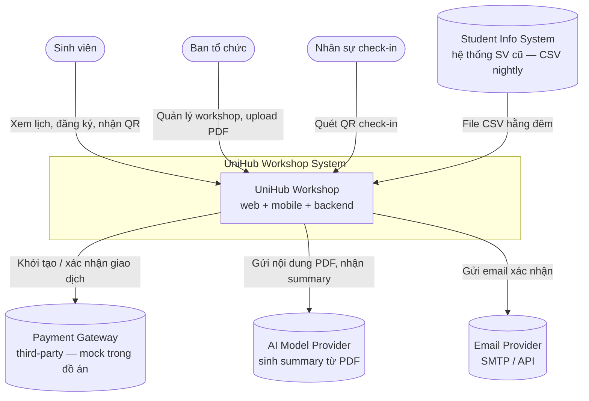
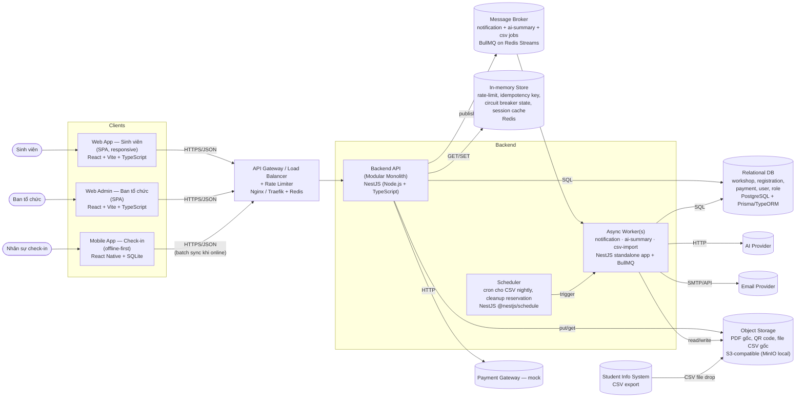
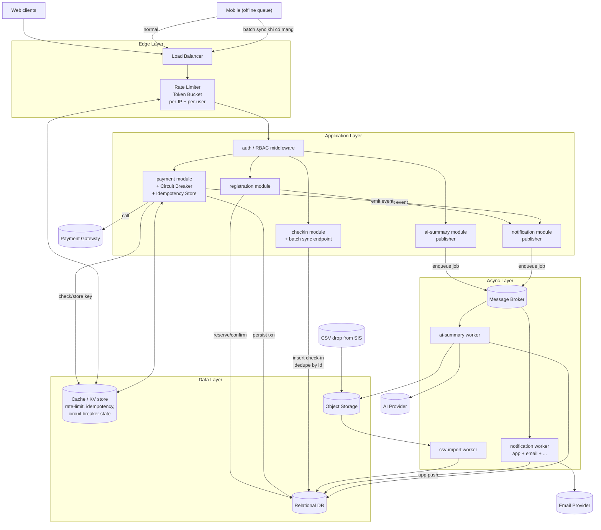
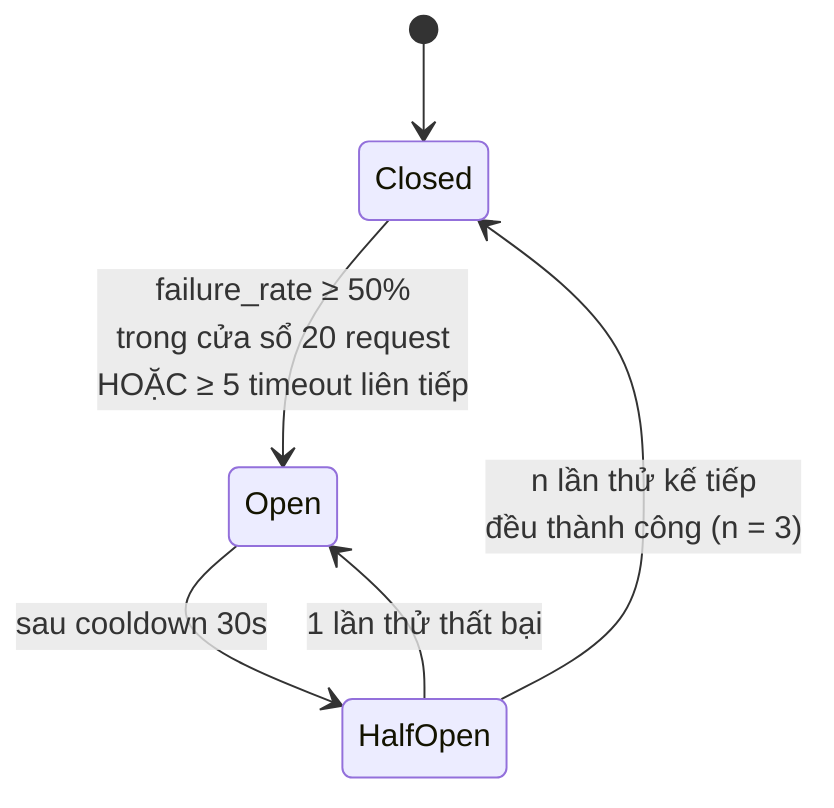
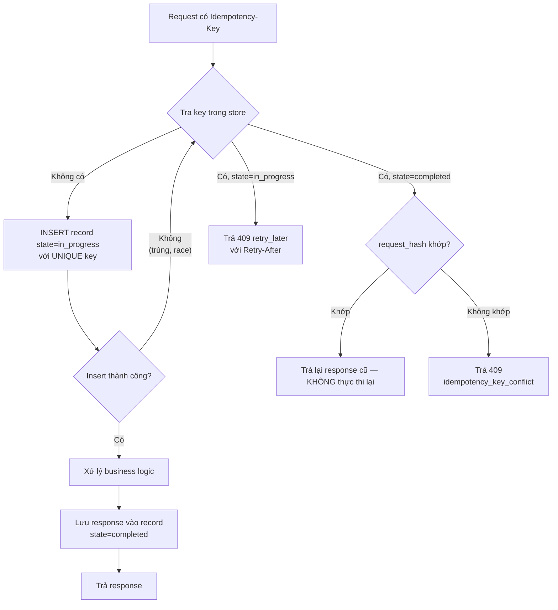

# UniHub Workshop — Technical Design

---

## 1. Kiến trúc tổng thể

### 1.1. Phong cách kiến trúc

**Modular Monolith cho Backend API** kết hợp với các **client tách biệt** (Web SV, Web Admin, Mobile Check-in) và một số **worker chạy nền** cho các tác vụ bất đồng bộ. Lý do:

- **Thời gian 2 tuần và số lượng thành viên**: Microservices ở backend tạo overhead vận hành.
- **Phạm vi đồ án và mục tiêu nghiệp vụ đơn giản**: Monolith cho phép các module centralized và refactor dễ dàng; chỉ nên tách khi mục tiêu nghiệp vụ đủ lớn và phức tạp.

| Module            | Trách nhiệm chính                                                                 |
| ----------------- | --------------------------------------------------------------------------------- |
| `auth`            | Xác thực, phát hành token, kiểm tra role (RBAC)                                   |
| `workshop`        | CRUD workshop, quản lý số chỗ, sơ đồ phòng                                        |
| `registration`    | Giữ chỗ (reservation), xác nhận, phát hành mã QR                                  |
| `payment`         | Khởi tạo giao dịch, tích hợp payment gateway (mock), idempotency, circuit breaker |
| `checkin`         | Nhận sự kiện check-in (kể cả offline sync batch), chống trùng                     |
| `notification`    | Điều phối gửi thông báo qua nhiều kênh (app, email, …), dễ mở rộng                |
| `ai-summary`      | Nhận PDF, trích text, gọi AI model, lưu summary                                   |
| `student-sync`    | Scheduled job import CSV hằng đêm từ hệ thống sinh viên cũ                        |
| `shared/platform` | Rate limiting, logging, health check, config, outbox table cho event nội bộ       |


### 1.2. Tác động khi một phần gặp sự cố (fault isolation)

| Thành phần hỏng          | Tác động                                  | Giải pháp cô lập                                                                                                    |
| ------------------------ | ----------------------------------------- | ------------------------------------------------------------------------------------------------------------------- |
| Payment gateway (ngoài)  | Không thanh toán được workshop có phí     | **Circuit Breaker** quanh client gateway + **Graceful Degradation**: workshop miễn phí, xem lịch, check-in vẫn chạy |
| AI provider (ngoài)      | Không sinh được summary mới               | Xử lý **bất đồng bộ** qua queue; trang workshop vẫn hiển thị với trạng thái "đang xử lý" / "chưa có summary"        |
| SMTP / email provider    | Không gửi được email xác nhận             | Notification gửi **fire-and-forget** qua queue + **retry có giới hạn**; luồng đăng ký không bị chặn                 |
| CSV import job           | Không có dữ liệu sinh viên mới từ đêm qua | Job chạy idempotent; admin nhận alert; dữ liệu cũ vẫn dùng được, sinh viên đăng ký trễ 1 ngày                       |
| Cache / rate-limit store | Rate limiter hỏng → API bị spam           | **Fail-closed ở edge** (trả 503 thay vì bypass limit); hoặc rơi về **in-process limiter** dự phòng                  |
| 1 instance API           | Các instance khác vẫn phục vụ             | Horizontal scaling + stateless API + health check ở load balancer                                                   |


---

## 2. C4 Diagram

### 2.1. Level 1 — System Context




### 2.2. Level 2 — Container




**Ghi chú lựa chọn công nghệ:**

- **Web App (Sinh viên + Admin) — React + Vite + TypeScript**:
	- Hệ sinh thái lớn, sẵn library cho form (`react-hook-form`), data fetching (`TanStack Query`), routing (`React Router`), UI kit (`shadcn/ui`, `MUI`).
	- So với **Angular**: nhẹ hơn, learning curve thấp hơn, phù hợp 2 tuần.
	- So với **Vue**: cộng đồng và nguồn tuyển nhân lực lớn hơn, dễ tìm tài liệu khi gặp vấn đề.
	- Hai web app dùng chung **monorepo (pnpm workspaces)** để chia sẻ types, API client, design tokens.
- **Mobile App (Check-in) — React Native**:
	- Cross-platform (iOS + Android) từ một codebase → giảm half effort so với native riêng biệt.
	- Có thể **dùng lại API client + types** từ web (đã viết bằng TypeScript) — quan trọng khi thời gian gấp.
	- So với **Flutter (Dart)**: nhóm đã có kỹ năng React → giảm thời gian học; không cần performance graphics cao cấp cho ứng dụng quét QR đơn giản.
	- Local storage: **WatermelonDB** hoặc **expo-sqlite** cho outbox check-in offline; thư viện QR: `react-native-vision-camera` + `vision-camera-code-scanner`.
- **Backend — NestJS (Node.js + TypeScript)**:
	- Kiến trúc **module-based** sẵn có → khớp trực tiếp với Modular Monolith đã chọn (mỗi module nghiệp vụ = một NestJS module).
	- **Dependency Injection** built-in → dễ test, dễ swap implementation (ví dụ `NotificationChannel` strategy ở ADR-7).
	- **Cùng ngôn ngữ TypeScript** với frontend → chia sẻ types qua package nội bộ, giảm bug ở contract API.
	- Hỗ trợ tốt: `@nestjs/typeorm` hoặc `Prisma` cho SQL, `@nestjs/bullmq` cho queue, `@nestjs/schedule` cho cron, `@nestjs/throttler` cho rate limit phụ trợ trong app, guards/interceptors hợp với RBAC ở section 5.
	- So với **Express thuần**: có sẵn cấu trúc, ít boilerplate cho team nhiều người.
	- So với **Spring Boot / Django**: nhẹ hơn, deploy đơn giản, đồng nhất ngôn ngữ với client.
- **Relational DB — PostgreSQL**: hỗ trợ transaction mạnh, `SELECT ... FOR UPDATE`, JSONB, constraint phong phú; ORM dùng **Prisma** hoặc **TypeORM** (chốt dựa trên migration story).
- **In-memory store — Redis**: cho rate-limit (`INCR` + Lua script atomic cho Token Bucket), idempotency record (fast path), circuit breaker shared state, BullMQ backend.
- **Message broker — Redis Streams + BullMQ** (mặc định) hoặc **RabbitMQ** nếu cần nhiều consumer pattern phức tạp:
	- BullMQ trên Redis đủ cho notification + ai-summary + csv-import trong phạm vi đồ án; tích hợp NestJS native qua `@nestjs/bullmq`.
	- Có sẵn retry, delayed jobs, dead-letter — đáp ứng yêu cầu retry có giới hạn ở section 1.2.


---

## 3. High-Level Architecture Diagram

Sơ đồ biểu diễn **luồng dữ liệu** và **điểm tích hợp** với hệ thống ngoài.




### 3.1. Luồng check-in offline (highlight)

1. Mobile app đã đăng nhập & cache danh sách workshop + danh sách sinh viên đã đăng ký của các phòng được phân công (pre-fetch khi còn mạng).
2. Khi quét QR, app **xác minh chữ ký QR cục bộ** (HMAC với secret cấp theo ca trực) → nếu hợp lệ thì ghi vào **outbox SQLite local** với `client_event_id` (UUID do mobile sinh) + `scanned_at` (timestamp client).
3. Khi có mạng, app gọi `POST /checkin/batch` gửi một mảng các event.
4. Server dedupe theo `(workshop_id, student_id, client_event_id)` — idempotent upsert, an toàn khi app retry.
5. Server trả về danh sách event đã accept / reject (lý do: đã check-in trước đó, không đăng ký, v.v.) → app cập nhật lại UI.


---

## 4. Thiết kế cơ sở dữ liệu

### 4.1. Lựa chọn loại database

Dùng **Relational DB (SQL)** làm kho dữ liệu chính, kết hợp với **key-value store** cho dữ liệu tạm thời và **object storage** cho blob.

| Loại dữ liệu                                                              | Storage             | Lý do                                                                                         |
| ------------------------------------------------------------------------- | ------------------- | --------------------------------------------------------------------------------------------- |
| User, Role, Workshop, Registration, Payment, CheckIn, AuditLog            | **Relational DB**   | Cần ACID cho nghiệp vụ giữ chỗ và thanh toán; quan hệ giữa các entity rõ ràng; query thống kê |
| Rate-limit counter, Idempotency key, Circuit breaker state, Session cache | **KV / in-memory**  | Truy cập rất nhiều, TTL ngắn, không cần bền vững tuyệt đối                                    |
| PDF gốc, file QR PNG/SVG, CSV gốc                                         | **Object Storage**  | Blob lớn, không truy vấn theo nội dung, chỉ cần URL                                           |
| Log sự kiện, metric                                                       | **Log store** (TBD) | Append-only, không thuộc luồng chính                                                          |

### 4.2. Schema các entity chính

Đây là schema mức logic — kiểu dữ liệu cụ thể có thể điều chỉnh theo DB được chọn.

```text
user
  id            PK
  student_code  UNIQUE NULL  -- chỉ điền với role student, đồng bộ từ CSV
  email         UNIQUE
  full_name
  password_hash NULL         -- NULL nếu dùng SSO (TBD)
  status        ENUM(active, disabled)
  created_at, updated_at

role
  id   PK
  code UNIQUE   -- 'student' | 'organizer' | 'checkin_staff' | 'admin'
  name

user_role            -- M:N, cho phép 1 user có nhiều role
  user_id  FK -> user
  role_id  FK -> role
  PRIMARY KEY (user_id, role_id)

workshop
  id              PK
  title
  speaker
  room
  room_map_url    -- trỏ object storage
  starts_at, ends_at
  capacity        INT          -- tổng số chỗ
  seats_left      INT          -- denormalized, giảm atomically khi reserve
  is_paid         BOOL
  price           DECIMAL NULL
  status          ENUM(draft, published, cancelled)
  ai_summary      TEXT NULL
  ai_summary_status ENUM(none, pending, ready, failed)
  version         INT          -- optimistic lock cho admin update
  created_at, updated_at

workshop_pdf
  id            PK
  workshop_id   FK
  file_key      -- key trong object storage
  uploaded_by   FK -> user
  uploaded_at

registration
  id              PK
  user_id         FK -> user
  workshop_id     FK -> workshop
  status          ENUM(reserved, confirmed, cancelled, expired)
  reserved_at
  expires_at      -- nếu có phí và chưa thanh toán đến lúc này thì expire
  confirmed_at    NULL
  qr_token        UNIQUE NULL  -- token ký, chỉ cấp khi confirmed
  UNIQUE (user_id, workshop_id)   -- mỗi SV chỉ 1 registration / workshop

payment
  id                   PK
  registration_id      FK -> registration UNIQUE
  idempotency_key      UNIQUE
  provider_txn_id      NULL
  amount               DECIMAL
  status               ENUM(pending, succeeded, failed, refunded)
  attempt_count        INT
  last_error           TEXT NULL
  created_at, updated_at

idempotency_record   -- có thể nằm ở cache, phản chiếu sang DB cho bền vững
  key                  PK
  request_hash         -- hash của payload để phát hiện "cùng key, khác payload"
  response_snapshot    JSON
  status               ENUM(in_progress, completed)
  expires_at

checkin
  id              PK
  registration_id FK -> registration
  client_event_id UUID        -- do mobile sinh, dùng cho dedupe offline sync
  scanned_at      -- timestamp client
  received_at     -- timestamp server
  staff_user_id   FK -> user
  UNIQUE (registration_id)                 -- 1 registration chỉ check-in 1 lần
  UNIQUE (client_event_id, staff_user_id)  -- dedupe retry từ mobile

notification_outbox
  id           PK
  user_id      FK
  channel      ENUM(app, email, ...)   -- mở rộng được
  template_code
  payload_json
  status       ENUM(pending, sent, failed)
  attempt_count
  created_at, sent_at

audit_log
  id, actor_user_id, action, entity_type, entity_id, metadata_json, at
```

**Ràng buộc/nguyên lý then chốt:**

- `workshop.seats_left` được cập nhật **trong cùng một transaction** với việc tạo `registration` (status=`reserved`). Dùng `UPDATE workshop SET seats_left = seats_left - 1 WHERE id=? AND seats_left > 0` để atomic decrement; nếu rowcount=0 → workshop đã hết chỗ.
- `UNIQUE (user_id, workshop_id)` trên `registration` đảm bảo một SV không thể đăng ký 2 lần cùng một workshop kể cả khi race.
- Khi `expires_at` qua → job nền chuyển `reserved` → `expired` và `seats_left += 1` trong transaction.
- `idempotency_record` vừa có bản ở cache (truy cập nhanh) vừa flush sang DB định kỳ để không mất khi cache restart.


---

## 5. Thiết kế kiểm soát truy cập

### 5.1. Mô hình: RBAC

Hệ thống dùng **Role-Based Access Control** vì ba nhóm người dùng trong yêu cầu (sinh viên / ban tổ chức / nhân sự check-in) là **ba vai trò rõ rệt, ổn định**, và quyền của họ không phụ thuộc vào thuộc tính runtime — đây là ngữ cảnh lý tưởng cho RBAC. ABAC sẽ thừa phức tạp.

### 5.2. Các role và quyền


| Role            | Quyền (permission) — kèm phạm vi                                                                                                                 |
| --------------- | ------------------------------------------------------------------------------------------------------------------------------------------------ |
| `student`       | `workshop:read`, `registration:create(self)`, `registration:read(self)`, `registration:cancel(self)`, `qr:read(self)`, `notification:read(self)` |
| `organizer`     | `workshop:*`, `workshop_pdf:upload`, `registration:read(any)`, `stats:read`, `ai_summary:trigger`                                                |
| `checkin_staff` | `checkin:create`, `checkin:batch_sync`, `registration:read(byqr)` (chỉ đọc để xác minh)                                                          |
| `admin`         | Bao gồm tất cả — dùng cho seeding và vận hành                                                                                                    |


**Nguyên tắc scope `(self)` / `(any)`:** với các quyền có hậu tố `(self)`, server phải tự kiểm tra `resource.owner_id == current_user.id` — client không được tin để truyền bừa `user_id`.

### 5.3. Kiểm tra quyền tại các điểm truy cập

Kiểm tra quyền luôn thực hiện **ở server**, chia thành 3 lớp, áp dụng tuần tự cho **mọi request**:

1. **Authentication middleware** — xác thực token, load `user` + `roles` vào request context. Token-based authentication (xem ADR-2); không có token hợp lệ → 401.
2. **Authorization middleware / decorator theo route** — khai báo `@require('workshop:write')` ngay trên handler. Thiếu permission → 403. Permission được giải ra từ `roles` (bảng `role_permission` load vào memory khi boot).
3. **Scope check trong service layer** — cho các quyền `(self)`. Ví dụ `registration:read(self)` kiểm tra `registration.user_id == ctx.user.id`.

Thực thi tại từng bề mặt:

- **Backend API** — bắt buộc qua cả 3 lớp trên.
- **Web Admin** — ẩn/hiện menu theo role (chỉ là UX); quyết định thực tế vẫn do server. Route admin kiểm tra `role in {organizer, admin}` ở cả frontend guard và backend middleware.
- **Mobile check-in app** — login của app **chỉ phát token có role `checkin_staff`**; các endpoint khác (ví dụ `workshop:write`) sẽ trả 403 ngay cả khi client cố gọi.
- **QR token** — là một **token riêng, ký bằng secret của server**, chỉ mã hoá `registration_id` + `expires_at`. Quét QR KHÔNG phải là hành động xác thực người quét — người quét (nhân sự) vẫn phải đăng nhập bằng token `checkin_staff` để gọi `POST /checkin`.

---

## 6. Thiết kế các cơ chế bảo vệ hệ thống

### 6.1. Kiểm soát tải đột biến — Rate Limiting

**Vấn đề:** ~12.000 sinh viên truy cập trong 10 phút đầu, 60% dồn vào 3 phút đầu. Cần ngăn backend API quá tải, ngăn 1 client spam, và đảm bảo công bằng.

**Giải pháp:** **Token Bucket** ở edge layer, với nhiều lớp khoá khác nhau.


| Lý do chọn Token Bucket (so với Fixed/Sliding Window, Leaky Bucket)                                                  |
| -------------------------------------------------------------------------------------------------------------------- |
| **Cho phép burst có kiểm soát** — sinh viên thao tác thật sự theo burst ngắn (xem chi tiết → đăng ký → xem kết quả). |
| **Smooth steady-state** — refill rate kiểm soát được tải trung bình ổn định.                                         |
| **Triển khai gọn trên Redis** bằng một Lua script atomic.                                                            |
| **Không có vấn đề "edge of window"** như Fixed Window (trong đó 2× quota có thể đi qua quanh mốc reset).             |


**Cấu hình đa lớp (các con số là điểm khởi đầu, điều chỉnh sau load test):**


| Scope                                 | Capacity          | Refill               | Mục đích                                    |
| ------------------------------------- | ----------------- | -------------------- | ------------------------------------------- |
| Per IP                                | 60 token          | 30/phút              | Chặn bot / script spam từ 1 máy             |
| Per user (sau auth)                   | 30 token          | 10/phút              | Công bằng giữa các sinh viên                |
| Per route `POST /registration` / user | 5 token           | 1/10 giây            | Chống double-click, giới hạn tốc độ đăng ký |
| Global per API instance               | — (circuit-level) | dựa trên CPU/latency | Shed load tổng, tránh cascading failure     |


**Hành vi khi vượt ngưỡng:**

- Trả về **HTTP 429** + header `Retry-After` + `X-RateLimit-`*.
- Request **không** được đưa vào queue nội bộ để đợi (để tránh queue phồng).
- Ở trang đăng ký, client bắt 429 và hiển thị "Bạn thao tác quá nhanh, thử lại sau {n}s" — tránh ức chế người dùng nghĩ là lỗi hệ thống.

**Fail-safe:** nếu Redis không phản hồi trong `X` ms, edge **fail-closed với limiter in-process** thấp hơn (ví dụ 10 req/s/instance) để không vô tình bypass.

### 6.2. Xử lý cổng thanh toán không ổn định — Circuit Breaker + Graceful Degradation

**Vấn đề:** payment gateway có thể timeout, lỗi kéo dài. Cần tránh kéo sập toàn hệ thống và tránh treo thread của các request khác.

**Giải pháp:** bọc mọi call ra payment gateway trong một **Circuit Breaker** với 3 trạng thái, lưu trạng thái ở cache chia sẻ (để tất cả instance API nhìn chung).




| Trạng thái    | Hành vi                                                                                          |
| ------------- | ------------------------------------------------------------------------------------------------ |
| **Closed**    | Gọi bình thường; đếm failure/success trong rolling window.                                       |
| **Open**      | Không gọi gateway nữa — fail-fast với error `payment_unavailable`. Không tốn thread chờ timeout. |
| **Half-Open** | Cho qua một số lượng nhỏ request thăm dò; nếu ổn → Closed, nếu còn lỗi → Open tiếp.              |


**Graceful Degradation khi breaker Open:**

- `POST /registration` cho workshop **có phí** trả về `202 accepted-pending-payment` hoặc `503 payment_unavailable` (tùy chiến lược) + thông báo thân thiện "Thanh toán tạm thời không khả dụng, bạn có thể thử lại sau mà không mất chỗ" (kèm cơ chế **reservation hold** để giữ chỗ X phút).
- Workshop **miễn phí**, xem lịch, xem chi tiết, check-in, thống kê admin — **vẫn hoạt động bình thường** vì không phụ thuộc gateway.
- Banner trên Web SV báo "Thanh toán đang gián đoạn, tính năng khác vẫn hoạt động bình thường".

**Ngưỡng (bắt đầu với, tinh chỉnh sau):**

- Window: 20 request hoặc 30 giây (cái nào đến trước).
- Ngưỡng mở: `failure_rate ≥ 50%` (trong đó timeout, 5xx, network error tính là failure; 4xx của client KHÔNG tính).
- Cooldown: 30 giây.
- Half-open probe: 3 request.

### 6.3. Chống trừ tiền hai lần — Idempotency Key

**Vấn đề:** client có thể retry (do mạng kém, user click lại, mobile sync lại). Một giao dịch **chỉ được ghi nhận đúng một lần**.

**Giải pháp:** mọi endpoint **tạo giao dịch / side-effect quan trọng** (`POST /payment`, `POST /registration`, `POST /checkin/batch`) yêu cầu header `Idempotency-Key`.

**Cơ chế sinh key:**

- **Client sinh UUIDv4** cho mỗi intent thao tác (một lần nhấn "Thanh toán" = một key cố định, dùng lại cho mọi retry của intent đó).
- Server **không** tự sinh key — key phải đến từ client mới bảo vệ được retry do mạng.

**Nơi lưu trữ:** bảng `idempotency_record` ở **cache (Redis)** để fast path, flush sang **SQL** theo batch để bền vững (survives cache restart).

Schema record:

```
key             PK
request_hash    -- SHA-256 của (user_id + endpoint + payload canonical)
response_body   -- JSON của response đã trả lần đầu
status_code     -- HTTP code đã trả lần đầu
state           ENUM(in_progress, completed)
created_at
expires_at      -- TTL 24h (đủ dài để cover mọi retry hợp lý)
```

**Luồng xử lý khi request đến:**




**Điểm then chốt:**

- `INSERT` với ràng buộc `UNIQUE(key)` là điểm serialize race — chỉ 1 request thắng, các request còn lại rơi vào nhánh "đã tồn tại".
- `request_hash` chống lỗi client dùng **cùng key cho 2 payload khác nhau** — trả 409 ngay thay vì ghi đè.
- TTL 24h: đủ cho mọi kịch bản retry thực tế (network glitch, offline sync…). Record hết hạn được cleanup bằng TTL Redis + job dọn dẹp định kỳ ở SQL.
- **Tại tầng payment**, idempotency key của UniHub còn được truyền **xuống payment gateway** (các gateway chuẩn đều hỗ trợ) — nếu gateway đã xử lý key này thì nó cũng trả nguyên giao dịch cũ, tránh double-charge kể cả khi server UniHub crash giữa chừng.

---

## 7. Các quyết định kỹ thuật quan trọng (ADR)

### ADR-1: Modular Monolith thay vì Microservices — hiện thực bằng NestJS

- **Lựa chọn:** một backend process duy nhất viết bằng **NestJS**, chia thành các module (`auth`, `workshop`, `registration`, `payment`, …) ánh xạ 1-1 với module nghiệp vụ ở section 1.1.
- **Tại sao:** phạm vi đồ án, team size nhỏ, cần transaction ACID xuyên nhiều entity ở luồng đăng ký + thanh toán. NestJS có cấu trúc module + DI sẵn — không phải tự thiết kế lại layering.
- **Đánh đổi:** scaling kém linh hoạt hơn; một lỗi nặng ở module có thể ảnh hưởng process → bù lại bằng async worker (NestJS standalone app) tách riêng cho job nặng (AI, email, CSV).
- **Điều kiện rút khỏi quyết định này:** khi phải phục vụ >> tải hiện tại, hoặc các module có nhịp phát triển rất khác nhau → có thể tách module thành microservice nhờ ranh giới module đã rõ ràng từ đầu.

### ADR-2: Token-based Authentication (JWT) cho API

- **Lựa chọn:** JWT stateless cho Web SV, Web Admin và Mobile, hiện thực bằng `@nestjs/jwt` + `@nestjs/passport` ở backend.
- **Tại sao:** Mobile cần hoạt động offline → không thể gọi server check session mỗi request; nhiều client khác loại → cookie/session không tiện; backend stateless dễ scale ngang.
- **Đánh đổi:** khó revoke token trước hạn → giảm thiểu bằng TTL ngắn cho access token (ví dụ 15 phút) + refresh token có thể revoke (lưu hash trong Redis).
- **Thuật toán ký:** **RS256** — Web (React) và Mobile (React Native) verify token cục bộ bằng public key mà không cần shared secret; thuận lợi cho QR token offline ở mobile.

### ADR-3: Relational DB làm kho dữ liệu chính

- **Lựa chọn:** SQL (đề xuất PostgreSQL).
- **Tại sao:** nghiệp vụ lõi cần ACID, constraint phức tạp, quan hệ nhiều — đúng sở trường RDBMS. Số lượng entity không quá lớn, không có yêu cầu về schema động.
- **Đánh đổi:** phải chú ý lock và index khi có tải cao → giải quyết bằng atomic decrement + index phù hợp + reservation timeout job.
- **TBD:** vendor cụ thể (PostgreSQL vs MySQL).

### ADR-4: Token Bucket cho Rate Limiting

- **Lựa chọn:** Token Bucket ở edge, lưu state trên Redis.
- **Tại sao:** cho phép burst ngắn — khớp hành vi thực tế của sinh viên — trong khi vẫn giới hạn tải trung bình. Không có vấn đề "edge of window".
- **Đánh đổi:** phụ thuộc Redis → có fallback in-process khi Redis không phản hồi.

### ADR-5: Circuit Breaker trạng thái chia sẻ

- **Lựa chọn:** Circuit Breaker quanh payment gateway client, **state chia sẻ qua cache** thay vì per-instance.
- **Tại sao:** nếu mỗi instance có breaker riêng, khi gateway hỏng, mỗi instance phải "tự học" lại → mất thêm request bị timeout trước khi mở → chia sẻ state phản ứng nhanh hơn và nhất quán hơn.
- **Đánh đổi:** thêm phụ thuộc Redis cho breaker; nếu Redis hỏng → rơi về per-instance breaker local như dự phòng.

### ADR-6: Xử lý bất đồng bộ cho Notification và AI Summary — BullMQ trên Redis

- **Lựa chọn:** publish sự kiện ra **BullMQ (Redis Streams)** qua `@nestjs/bullmq`; worker là một NestJS standalone app share code với API.
- **Tại sao:** luồng đăng ký không được chờ email/AI; cả hai kênh này đều có dependency ngoài không tin cậy được. BullMQ đủ tính năng (retry exponential, delayed job, dead-letter, rate limit per queue) cho phạm vi đồ án mà không phải vận hành thêm Kafka/RabbitMQ.
- **Transactional outbox:** để tránh mất event khi DB commit thành công nhưng publish broker thất bại, event được ghi vào bảng `outbox` trong cùng transaction (Postgres) với business write; một relay job (NestJS scheduled task) đọc outbox → enqueue BullMQ → đánh dấu đã gửi. Đảm bảo **at-least-once**, cộng với idempotency key bên consumer → hiệu ứng end-to-end là **effectively-once**.
- **Khi nào nâng cấp lên Kafka/RabbitMQ:** nếu cần fan-out nhiều consumer độc lập, replay event từ đầu, hoặc throughput vượt giới hạn của Redis (~vài chục nghìn msg/s).

### ADR-7: Notification Channel mở rộng qua Strategy

- **Lựa chọn:** `notification` module định nghĩa interface `NotificationChannel` với method `send(payload)`; các kênh (`AppChannel`, `EmailChannel`, sau này `TelegramChannel`…) implement interface. Chọn kênh theo cấu hình template + user preference.
- **Tại sao:** yêu cầu rõ là "dễ bổ sung kênh mới mà không thay đổi lớn" — đây là ứng dụng kinh điển của **Strategy Pattern + Open/Closed**.
- **Mở rộng:** thêm kênh mới = implement interface + đăng ký vào registry + bổ sung enum `channel` — không sửa code của module khác.

### ADR-8: CSV Import chạy nền, idempotent upsert

- **Lựa chọn:** job theo lịch dùng **`@nestjs/schedule` (cron)** vào giờ thấp điểm; reader stream CSV bằng `csv-parse` (Node.js native streams) → validate từng record bằng `class-validator` (đã quen thuộc trong NestJS) → `UPSERT` theo `student_code` qua Prisma/TypeORM.
- **Tại sao:** hệ thống cũ không có API, chỉ có file. Idempotent để file có thể replay an toàn. Stream parsing tránh load toàn bộ file vào RAM khi CSV lớn.
- **Quarantine:** file sai định dạng → chuyển sang folder `rejected/` trong object storage + enqueue notification cho admin (BullMQ); không chặn service chính.
- **Vì sao scheduler trong app:** đồ án không có infra riêng cho cron bên ngoài; `@nestjs/schedule` chạy cùng worker process là đủ. Chỉ rút khỏi quyết định khi cần HA scheduler (ví dụ với leader election).

### ADR-9: QR Token ký server-side

- **Lựa chọn:** QR chứa một token ngắn đã ký (HMAC hoặc JWS) mã hoá `registration_id + expires_at`, **không** chứa PII.
- **Tại sao:** chống giả mạo QR (nhân sự offline vẫn verify được chữ ký bằng public key / shared secret cấp theo ca), và cho phép revoke bằng cách đánh dấu `registration.status = cancelled` ở server khi có mạng.
- **TBD:** thuật toán ký cụ thể.

